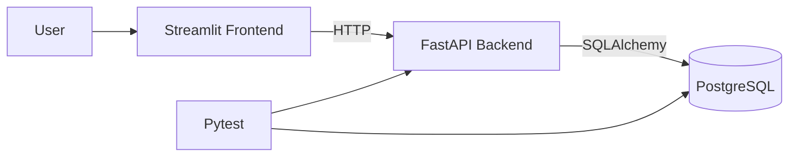
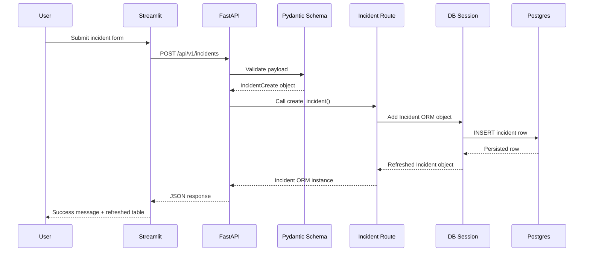
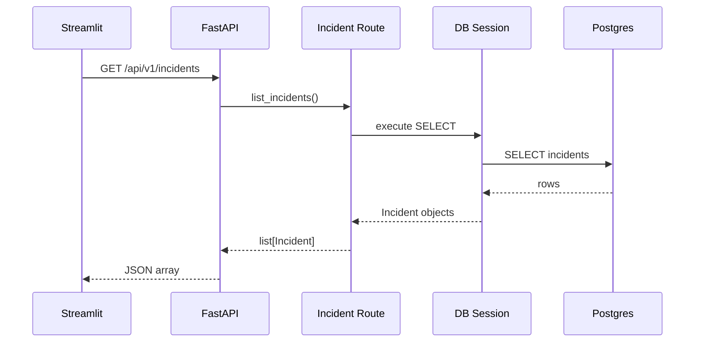
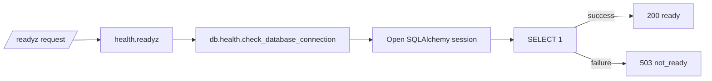
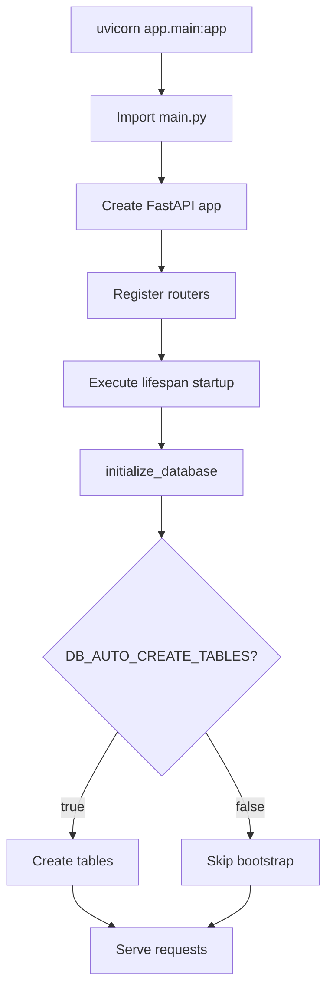
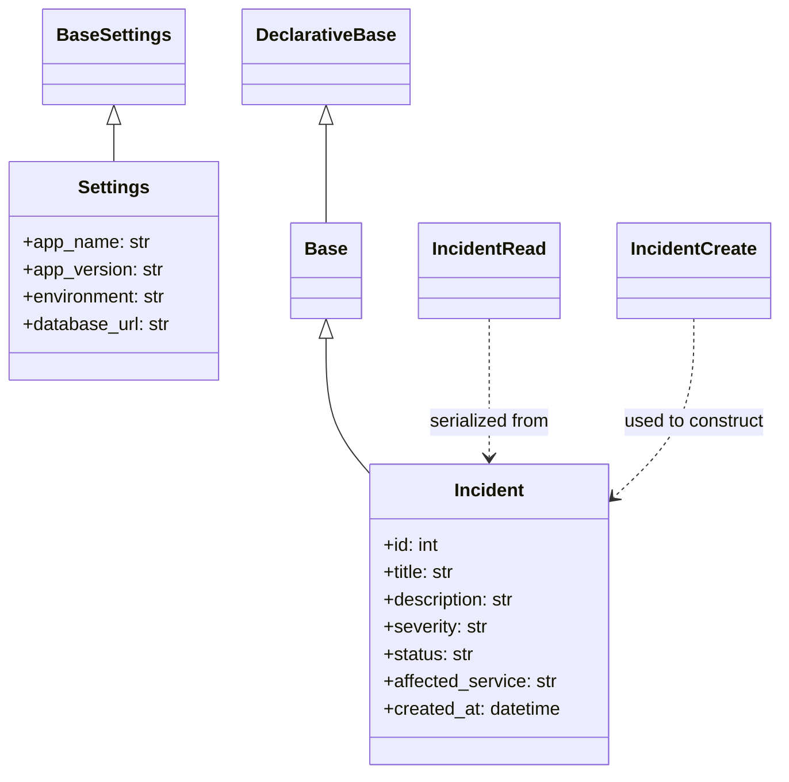

# Cluster Reactor Knowledge Base

> [!info] Purpose
> This document is the current **project documentation**, **learning notebook**, and **interview preparation guide** for Cluster Reactor.
>
> It is written for two audiences at once:
> 1. a beginner who wants clear explanations,
> 2. an engineer who wants production-oriented reasoning.

**Tags:** #cluster-reactor #fastapi #streamlit #postgresql #pytest #sre #platform-engineering #kubernetes #devops #obsidian

---

## Table of Contents

- [[#1 Project Overview]]
- [[#2 Objectives and Learning Goals]]
- [[#3 Current Implementation Scope]]
- [[#4 Repository Structure]]
- [[#5 Architecture Overview]]
- [[#6 Backend Deep Dive]]
- [[#7 Database Layer Deep Dive]]
- [[#8 Frontend Deep Dive]]
- [[#9 Test Layer Deep Dive]]
- [[#10 Configuration and Dependency Files]]
- [[#11 End-to-End Request and Execution Flow]]
- [[#12 Startup Flow]]
- [[#13 Function and Method Reference]]
- [[#14 Class and Relationship Notes]]
- [[#15 Design Patterns and Engineering Decisions]]
- [[#16 Dependencies and Why They Were Chosen]]
- [[#17 Important Development Commands]]
- [[#18 Test Execution and Reporting]]
- [[#19 Troubleshooting Guide]]
- [[#20 Interview Preparation Notes]]
- [[#21 Obsidian Note Organization Suggestions]]
- [[#22 Current Gaps and Next Steps]]

---

## 1 Project Overview

**Cluster Reactor** is a production-inspired internal platform and reliability engineering application.

The main idea is simple:
- keep the business domain intentionally lightweight,
- make the **infrastructure, operations, and troubleshooting experience** the primary learning surface.

Today, the project already includes:
- a FastAPI backend,
- a Streamlit frontend,
- PostgreSQL-backed persistence,
- health and readiness endpoints,
- incident create/list APIs,
- pytest-based tests,
- local runtime validation.

### Why this project exists

The project is meant to simulate how a real internal platform might evolve:
- local development,
- dependency management,
- service health,
- database connectivity,
- frontend-backend communication,
- containerization later,
- Kubernetes deployment later,
- observability later.

### One-line summary

> Cluster Reactor is a Kubernetes-first reliability learning platform built as a small internal operations console.

---

## 2 Objectives and Learning Goals

### Product objective

Build a small internal application that can:
- expose operational health,
- create and list incidents,
- visualize runtime state,
- later support richer operational workflows.

### Learning objective

Use the project to become stronger in:
- Kubernetes
- Linux troubleshooting
- Docker
- Docker Compose
- Jenkins and CI/CD
- Helm
- observability
- monitoring
- platform engineering
- SRE thinking

### Why the app layer stays simple

The system is not trying to be a complex business product.

Instead, it is trying to create realistic failure and recovery opportunities such as:
- backend up but DB down,
- readiness failing while process is alive,
- dependency misconfiguration,
- stateful service issues,
- rollout or startup-order issues later in Docker and Kubernetes.

---

## 3 Current Implementation Scope

### What is implemented so far

#### Backend
- FastAPI application entrypoint
- root endpoint
- liveness endpoint `/healthz`
- readiness endpoint `/readyz`
- system status endpoint `/api/v1/system/status`
- incident list endpoint `/api/v1/incidents`
- incident create endpoint `/api/v1/incidents`

#### Database
- SQLAlchemy engine/session setup
- PostgreSQL configuration via environment variables
- incident ORM model
- optional development-time table bootstrap
- readiness DB connectivity check

#### Frontend
- Streamlit dark-themed operations console
- Dashboard page
- Incident Console page
- Service Health page
- backend API client layer
- reusable UI helpers

#### Tests
- health endpoint tests
- readiness success/failure tests
- incident list/create tests using SQLite overrides

---

## 4 Repository Structure

```text
cluster-reactor/
├── backend/
│   └── app/
│       ├── __init__.py
│       ├── main.py
│       ├── api/
│       │   ├── __init__.py
│       │   ├── router.py
│       │   └── routes/
│       │       ├── __init__.py
│       │       ├── health.py
│       │       ├── incidents.py
│       │       └── system.py
│       ├── core/
│       │   ├── __init__.py
│       │   └── config.py
│       ├── db/
│       │   ├── base.py
│       │   ├── bootstrap.py
│       │   ├── health.py
│       │   └── session.py
│       ├── models/
│       │   ├── __init__.py
│       │   └── incident.py
│       └── schemas/
│           ├── __init__.py
│           └── incident.py
├── frontend/
│   ├── __init__.py
│   ├── api.py
│   ├── app.py
│   └── ui.py
├── tests/
│   ├── conftest.py
│   ├── test_health.py
│   └── test_incidents.py
├── .streamlit/
│   └── config.toml
├── docs/
│   └── cluster-reactor-knowledge-base.md
├── .env.example
├── .gitignore
├── pyrightconfig.json
└── requirements.txt
```

### Directory purpose summary

| Path | Purpose |
|---|---|
| `backend/app/` | Core FastAPI application code |
| `backend/app/api/` | API route registration and route modules |
| `backend/app/core/` | Configuration and shared core settings |
| `backend/app/db/` | DB engine, session, readiness check, and bootstrap logic |
| `backend/app/models/` | SQLAlchemy ORM models |
| `backend/app/schemas/` | Pydantic request/response contracts |
| `frontend/` | Streamlit UI code and API integration |
| `tests/` | API and readiness tests |
| `.streamlit/` | Streamlit runtime/theme configuration |
| `docs/` | Project documentation and learning artifacts |

---

## 5 Architecture Overview

### High-level architecture



### Responsibility split

- **Frontend**: presents operational data and sends user actions.
- **Backend**: validates requests, coordinates DB access, returns structured API responses.
- **Database**: stores incident records.
- **Tests**: verify route and data-flow behavior without depending on a live Postgres for every test.

### Why this split matters

This separation makes later platform work easier:
- Docker image boundaries are clearer,
- Kubernetes Deployments and Services are easier to reason about,
- observability and troubleshooting can be attached per layer.

---

## 6 Backend Deep Dive

### File: `backend/app/main.py`

**Purpose**
- creates the FastAPI application,
- attaches the application lifespan hook,
- registers all routers,
- defines the root route.

**Why it exists**
A production service needs a single authoritative application entrypoint.

**How it interacts with other components**
- imports `api_router` from the API layer,
- imports `settings` from the core config,
- imports `initialize_database()` from the DB bootstrap layer.

**Key code**

```python
@asynccontextmanager
async def lifespan(_: FastAPI):
    initialize_database()
    yield
```

**What this does**
- Runs application startup logic before serving requests.
- Right now it optionally creates tables when `DB_AUTO_CREATE_TABLES=true`.

**Why it exists**
This gives a development-friendly startup hook and introduces the concept of service lifecycle.

**Production note**
In mature production systems, startup hooks should not replace proper migrations.

---

### File: `backend/app/api/router.py`

**Purpose**
Central API registration point.

**Why it exists**
Without this, `main.py` would become a route-assembly dumping ground.

**Responsibilities**
- registers health routes,
- registers system routes,
- registers incident routes.

**Benefit**
Keeps the application modular and easier to extend later.

---

### File: `backend/app/api/routes/health.py`

**Purpose**
Expose liveness and readiness endpoints.

**Endpoints**
- `GET /healthz`
- `GET /readyz`

**Why these matter**
- `healthz` answers: *is the process alive?*
- `readyz` answers: *can this service actually do useful work right now?*

**Key logic**

```python
database_available, message = check_database_connection()
if not database_available:
    return JSONResponse(status_code=503, ...)
```

**Why this is important**
This is one of the most production-meaningful pieces of the system.

If the process is alive but Postgres is down:
- `/healthz` can still return `200`,
- `/readyz` should return `503`.

That is exactly the distinction Kubernetes uses later for probes.

---

### File: `backend/app/api/routes/system.py`

**Purpose**
Expose non-sensitive runtime metadata.

**Endpoint**
- `GET /api/v1/system/status`

**Why it exists**
Useful for:
- local verification,
- deployment validation,
- environment debugging,
- future release metadata checks.

---

### File: `backend/app/api/routes/incidents.py`

**Purpose**
Handle incident read/write API behavior.

**Endpoints**
- `GET /api/v1/incidents`
- `POST /api/v1/incidents`

**GET flow**
1. FastAPI injects a DB session.
2. The route builds a `select(Incident)` statement.
3. Results are ordered newest-first.
4. SQLAlchemy model objects are returned.
5. FastAPI/Pydantic serializes them to `IncidentRead` response objects.

**POST flow**
1. FastAPI validates request payload against `IncidentCreate`.
2. Route constructs an ORM `Incident` object.
3. SQLAlchemy writes it to the DB.
4. Session commits and refreshes the object.
5. Route returns persisted data as `IncidentRead`.

**Side effects**
- GET: reads database state.
- POST: writes a new row to the incidents table.

**Current limitation**
DB exceptions are not yet converted into clean API-layer error responses.
That is a good next-step improvement.

---

## 7 Database Layer Deep Dive

### File: `backend/app/core/config.py`

**Purpose**
Central configuration object using environment variables.

**Why it exists**
Configuration should not be scattered across files.

**Key responsibilities**
- defines app metadata,
- defines Postgres connectivity fields,
- computes `database_url`,
- loads values from `.env` if present.

**Important property**

```python
def database_url(self) -> str:
    return (
        "postgresql+psycopg://"
        f"{self.db_user}:{self.db_password}@{self.db_host}:{self.db_port}/{self.db_name}"
    )
```

**Concept being taught**
Configuration composition and env-driven runtime setup.

---

### File: `backend/app/db/base.py`

**Purpose**
Defines the SQLAlchemy declarative base class.

**Why it exists**
All ORM models should inherit from a single metadata root so SQLAlchemy can manage tables consistently.

---

### File: `backend/app/db/session.py`

**Purpose**
Create the SQLAlchemy engine and request-scoped session factory.

**Key objects**
- `engine`
- `SessionLocal`
- `get_db_session()`

**Why it exists**
This separates infrastructure concerns from route logic.

**Code concept**

```python
def get_db_session() -> Generator[Session, None, None]:
    session = SessionLocal()
    try:
        yield session
    finally:
        session.close()
```

**Why this matters**
It ensures DB sessions are always closed, even if request handling fails.

**Future Kubernetes relevance**
This is where connection pooling, saturation, and DB connectivity issues will later surface under load.

---

### File: `backend/app/db/health.py`

**Purpose**
Run a minimal DB query to determine readiness.

**Current strategy**
- open a session,
- run `SELECT 1`,
- return `(True, "available")` or `(False, error_message)`.

**Why this is good**
It isolates probe logic away from the route layer and makes testing much easier.

---

### File: `backend/app/db/bootstrap.py`

**Purpose**
Optionally auto-create tables during app startup.

**Current behavior**
Only runs when `DB_AUTO_CREATE_TABLES=true`.

**Why it exists**
- useful for local dev and Phase 1 verification,
- not intended as the long-term production migration strategy.

**Principal engineering note**
This is acceptable as a learning convenience, but later you should replace it with an explicit migration workflow.

---

### File: `backend/app/models/incident.py`

**Purpose**
Defines the persisted incident table shape.

**Fields**
- `id`
- `title`
- `description`
- `severity`
- `status`
- `affected_service`
- `created_at`

**Why this model is important**
This is the first real domain object in the system.

**Relationship note**
There are no foreign keys yet, so the model is currently standalone.

---

### File: `backend/app/schemas/incident.py`

**Purpose**
Defines request and response contracts.

**Classes**
- `IncidentSeverity`
- `IncidentStatus`
- `IncidentCreate`
- `IncidentRead`

**Why schemas matter**
They separate:
- what the API accepts,
- what the database stores,
- what the API returns.

That separation becomes very important as systems evolve.

---

## 8 Frontend Deep Dive

### File: `frontend/app.py`

**Purpose**
Main Streamlit application entrypoint.

**Pages included**
- Dashboard
- Incident Console
- Service Health

**Why it exists**
This is the operator-facing control surface.

**Major responsibilities**
- configure Streamlit page settings,
- ensure the repo root is importable,
- call frontend API helpers,
- render different screens,
- display backend or DB issues clearly.

**Notable behavior**
The code uses `safe_call()` to catch `requests` failures and avoid crashing the UI.

```python
def safe_call(callable_obj, fallback):
    try:
        return callable_obj()
    except requests.RequestException as exc:
        st.session_state["cluster_reactor_last_error"] = str(exc)
        return fallback
```

**Why it exists**
Internal tools should degrade gracefully when backend dependencies fail.

---

### File: `frontend/api.py`

**Purpose**
Central HTTP client wrapper for the frontend.

**Why it exists**
Without this file, HTTP requests would be duplicated across UI code.

**Responsibilities**
- define backend base URL,
- set request timeout,
- expose typed helper functions for each backend endpoint.

**Good practice demonstrated**
Encapsulating transport logic in one place makes later changes easier.

---

### File: `frontend/ui.py`

**Purpose**
Reusable visual helpers and styling logic.

**Why it exists**
This keeps `frontend/app.py` focused on flow and behavior instead of raw CSS and layout fragments.

**Notable features**
- dark theme cards,
- status banners,
- incident tables,
- severity legends.

**Why it matters**
Even internal tools benefit from consistent visual semantics.

Operators scan colors and shape faster than prose.

---

### File: `.streamlit/config.toml`

**Purpose**
Global Streamlit configuration.

**Current use**
- dark visual theme,
- headless server mode,
- usage statistics disabled.

**Why this matters**
This gives the UI a more polished operational-console feel and makes local and future container execution cleaner.

---

## 9 Test Layer Deep Dive

### File: `tests/conftest.py`

**Purpose**
Ensure `backend/` is importable during tests.

**Why it exists**
The app package lives under `backend/app`, not at repo root.

**What it does**
Adds the backend directory to `sys.path` for pytest.

---

### File: `tests/test_health.py`

**Purpose**
Validate liveness and readiness behavior.

**Approach**
Monkeypatches the DB health function by assignment to simulate:
- database available,
- database unavailable.

**Why this is useful**
It proves probe behavior without needing a real DB for every test run.

---

### File: `tests/test_incidents.py`

**Purpose**
Validate incident list and create behavior.

**Key strategy**
- create an in-memory SQLite engine,
- override `get_db_session`,
- use FastAPI `TestClient` against the app.

**Why this is a strong test pattern**
It isolates API behavior from local Postgres availability while still exercising real DB logic.

---

## 10 Configuration and Dependency Files

### File: `requirements.txt`

**Purpose**
Defines Python dependencies for runtime and tests.

**Why it exists**
Provides consistency across:
- local development,
- future Docker builds,
- CI later.

### File: `.env.example`

**Purpose**
Template for expected environment variables.

**Why it exists**
- documents required config,
- supports onboarding,
- will later map cleanly to Docker Compose envs and Kubernetes ConfigMaps/Secrets.

### File: `.gitignore`

**Purpose**
Prevent local-only or generated artifacts from being committed.

**Examples ignored**
- `.venv/`
- `__pycache__/`
- `.env`
- `.DS_Store`

### File: `pyrightconfig.json`

**Purpose**
Help static analysis resolve backend and frontend import paths.

**Why it exists**
The project uses non-trivial import roots, so editor tooling needs guidance.

---

## 11 End-to-End Request and Execution Flow

### Incident creation flow



### Incident list flow



### Readiness flow



---

## 12 Startup Flow

### Backend startup flow



### Test startup flow

1. `pytest` loads `tests/conftest.py`.
2. `backend/` is added to `sys.path`.
3. test modules import the FastAPI app.
4. test-specific DB overrides are applied when needed.
5. each test calls application routes through `TestClient`.

---

## 13 Function and Method Reference

### Backend functions

| Function | File | Input | Output | Side Effects |
|---|---|---|---|---|
| `lifespan()` | `backend/app/main.py` | FastAPI app | async context lifecycle | may create tables |
| `root()` | `backend/app/main.py` | none | service metadata dict | none |
| `healthz()` | `backend/app/api/routes/health.py` | none | `{status: ok}` | none |
| `readyz()` | `backend/app/api/routes/health.py` | none | JSONResponse | opens DB health check |
| `system_status()` | `backend/app/api/routes/system.py` | none | runtime metadata | none |
| `list_incidents()` | `backend/app/api/routes/incidents.py` | DB session | list of incidents | DB read |
| `create_incident()` | `backend/app/api/routes/incidents.py` | validated payload, DB session | created incident | DB write |
| `get_db_session()` | `backend/app/db/session.py` | none | generator of Session | open/close DB session |
| `check_database_connection()` | `backend/app/db/health.py` | none | `(bool, str)` | DB query |
| `initialize_database()` | `backend/app/db/bootstrap.py` | none | none | may create DB tables |

### Frontend functions

| Function | File | Responsibility |
|---|---|---|
| `_request()` | `frontend/api.py` | low-level HTTP wrapper |
| `get_root_status()` | `frontend/api.py` | fetch root metadata |
| `get_health()` | `frontend/api.py` | fetch liveness |
| `get_readiness()` | `frontend/api.py` | fetch readiness |
| `get_system_status()` | `frontend/api.py` | fetch runtime metadata |
| `list_incidents()` | `frontend/api.py` | fetch incidents |
| `create_incident()` | `frontend/api.py` | post incident |
| `inject_global_styles()` | `frontend/ui.py` | inject CSS |
| `render_metric_card()` | `frontend/ui.py` | reusable metric card |
| `render_status_banner()` | `frontend/ui.py` | reusable status banner |
| `render_incidents_table()` | `frontend/ui.py` | incident table rendering |
| `render_dashboard()` | `frontend/app.py` | dashboard page assembly |
| `render_incident_console()` | `frontend/app.py` | incident form page |
| `render_service_health()` | `frontend/app.py` | service health page |

---

## 14 Class and Relationship Notes

### Configuration class
- `Settings` extends `BaseSettings`.
- This is inheritance used for env-aware configuration behavior.

### ORM base and model
- `Base` extends `DeclarativeBase`.
- `Incident` extends `Base`.
- This is inheritance used by SQLAlchemy ORM.

### Schema relationships
- `IncidentCreate` models request input.
- `IncidentRead` models API output.
- `IncidentRead` composes data sourced from `Incident` ORM objects.

### Relationship diagram



---

## 15 Design Patterns and Engineering Decisions

### 1. Layered architecture

Used layers:
- route layer,
- schema layer,
- model layer,
- DB/session layer,
- config layer,
- frontend API client layer.

**Why chosen**
It keeps responsibilities clean and scalable.

### 2. Dependency injection

FastAPI `Depends(get_db_session)` is used for route-scoped DB access.

**Why chosen**
This is a production-standard pattern for resource ownership and testability.

### 3. DTO / schema separation

Pydantic schemas are used separately from SQLAlchemy models.

**Why chosen**
It avoids tightly coupling transport and persistence formats.

### 4. Probe-aware design

Readiness depends on DB connectivity.

**Why chosen**
This teaches a real operational distinction early, before Kubernetes manifests even exist.

### 5. API client wrapper in frontend

The Streamlit UI does not call raw URLs inline everywhere.

**Why chosen**
This is easier to maintain and change later.

---

## 16 Dependencies and Why They Were Chosen

| Package | Why it was chosen |
|---|---|
| `fastapi` | modern Python API framework with good dependency injection and validation support |
| `uvicorn[standard]` | standard ASGI server for FastAPI |
| `streamlit` | fast internal-tool UI development with low boilerplate |
| `sqlalchemy` | production-standard ORM and DB toolkit |
| `psycopg[binary]` | PostgreSQL driver with simple local setup |
| `pydantic-settings` | environment-driven configuration management |
| `python-dotenv` | local `.env` loading support |
| `requests` | simple synchronous HTTP client for Streamlit |
| `pytest` | standard Python testing framework |
| `httpx` | useful for API testing ecosystems, though current tests primarily use TestClient |

### Interview-oriented reasoning

A good answer for dependency choice is not just “because it works.”

A stronger answer is:
- what problem it solves,
- why it fits the scale of the current phase,
- what trade-off it introduces,
- what you might replace later if the system grows.

---

## 17 Important Development Commands

### Create and activate virtual environment

```bash
python3.12 -m venv .venv
source .venv/bin/activate
```

**Why**
Creates an isolated Python environment for the project.

### Install dependencies

```bash
pip install -r requirements.txt
```

### Run tests

```bash
pytest -q
```

### Start backend

```bash
DB_AUTO_CREATE_TABLES=true PYTHONPATH=backend uvicorn app.main:app --app-dir backend --port 8000
```

**Why the env vars matter**
- `DB_AUTO_CREATE_TABLES=true` enables local bootstrap.
- `PYTHONPATH=backend` makes the `app` package importable for Uvicorn.

### Start frontend

```bash
streamlit run frontend/app.py --server.port 8502 --server.headless true
```

### Check readiness

```bash
curl -sS http://127.0.0.1:8000/readyz
```

### Create local Postgres DB if needed

```bash
brew services start postgresql@16
```

---

## 18 Test Execution and Reporting

### Current test categories

#### Health tests
- validate liveness
- validate readiness success
- validate readiness failure

#### Incident tests
- empty list behavior
- successful creation
- ordering of returned incidents

### Why SQLite is used in tests

SQLite is used in `tests/test_incidents.py` because:
- it is fast,
- it avoids a hard dependency on a local Postgres instance,
- it still exercises ORM and route logic.

### Current reporting mode

`pytest -q` produces concise output.

Example:

```bash
6 passed in 0.54s
```

### Future improvements
- add coverage reporting,
- add split between unit and integration tests,
- add CI test stages.

---

## 19 Troubleshooting Guide

> [!warning] Common issue: `.venv` accidentally staged in Git
> Symptom: thousands of files show up in Source Control.
>
> Fix:
> - keep `.venv/` in `.gitignore`,
> - `git reset`,
> - re-stage only intended files.

### Issue: `python` not found on macOS

**Cause**
macOS/Homebrew often provides `python3`, not `python` globally.

**Fix**
Use `python3` to create the venv, then `python` inside the venv.

### Issue: `ModuleNotFoundError: No module named 'app'`

**Cause**
`backend/` is not on the import path.

**Fix**
- use `PYTHONPATH=backend` when starting backend,
- use `tests/conftest.py` for pytest,
- use `pyrightconfig.json` for editor resolution.

### Issue: Streamlit import failure for `frontend.*`

**Cause**
Streamlit runs `frontend/app.py` as a script.

**Fix**
- make `frontend` a package with `frontend/__init__.py`,
- add repo root to `sys.path` early in `frontend/app.py`.

### Issue: `/readyz` returns `503`

**Cause**
Database connectivity failure.

**What to check**
- Postgres service running?
- correct DB host/port?
- correct role and password?
- DB exists?

### Issue: `/api/v1/incidents` fails with `OperationalError`

**Cause**
Business route requires DB, and DB is unavailable.

**Important lesson**
This is expected when readiness is failing.

---

## 20 Interview Preparation Notes

### Q: What is the difference between liveness and readiness?

**Strong answer**
- Liveness checks whether the process is alive.
- Readiness checks whether the service can actually handle traffic.
- A service can be alive but not ready if a critical dependency like Postgres is down.

### Q: Why use dependency injection for DB sessions?

**Strong answer**
It centralizes resource lifecycle management, improves testability, and prevents routes from owning session construction details.

### Q: Why separate ORM models from API schemas?

**Strong answer**
It decouples transport shape from persistence shape, making validation, evolution, and security easier.

### Q: Why use environment variables for config?

**Strong answer**
They are standard for containerized and orchestrated workloads, map cleanly to Docker/Kubernetes, and avoid hardcoding deployment-specific values.

### Q: Why use SQLite in tests if production uses Postgres?

**Strong answer**
For fast isolated route-level tests. But I would still add true Postgres integration tests later for dialect-specific behavior.

### Q: Why is auto-creating tables at startup not ideal for production?

**Strong answer**
It hides migration concerns, makes rollout behavior less explicit, and can introduce startup coupling. Production systems should use controlled migration workflows.

---

## 21 Obsidian Note Organization Suggestions

### Suggested vault structure

```text
Cluster Reactor Vault/
├── 00 - Index/
├── 01 - Architecture/
├── 02 - Backend/
├── 03 - Frontend/
├── 04 - Database/
├── 05 - Testing/
├── 06 - DevOps and Kubernetes/
└── 99 - Interview Prep/
```

### Suggested note splits later
- `FastAPI Routing in Cluster Reactor`
- `Readiness vs Liveness in Cluster Reactor`
- `SQLAlchemy Session Lifecycle`
- `Incident API Design`
- `Streamlit Internal Tool Patterns`
- `Testing FastAPI with Dependency Overrides`

### Internal link ideas
- `[[Cluster Reactor Knowledge Base]]`
- `[[Readiness vs Liveness]]`
- `[[FastAPI Dependency Injection]]`
- `[[SQLAlchemy Session Pattern]]`
- `[[Incident API Flow]]`

---

## 22 Current Gaps and Next Steps

### Important current gaps
- no Dockerfile yet
- no Docker Compose yet
- no Jenkins pipeline yet
- no Kubernetes manifests yet
- no Helm chart yet
- no Prometheus/Grafana yet
- no DB migration framework yet
- no clean API-level DB exception translation yet

### Best next steps

#### Option A: Phase 2 Dockerization
- backend image
- frontend image
- Docker Compose for backend + frontend + Postgres

#### Option B: Backend hardening first
- graceful DB exception handling
- API error response consistency
- better startup and bootstrap discipline

### Recommended next move

The strongest next move is:
1. harden DB exception handling,
2. then Dockerize the stack,
3. then move to Docker Compose.

That sequence keeps the service behavior clean before packaging it.

---

## Appendix A - File-by-File Quick Reference

| File | Why it exists |
|---|---|
| `backend/app/main.py` | application entrypoint and startup lifecycle |
| `backend/app/api/router.py` | central route registration |
| `backend/app/api/routes/health.py` | liveness and readiness endpoints |
| `backend/app/api/routes/system.py` | runtime metadata endpoint |
| `backend/app/api/routes/incidents.py` | incident list/create API |
| `backend/app/core/config.py` | environment-driven config |
| `backend/app/db/base.py` | SQLAlchemy metadata base |
| `backend/app/db/session.py` | DB engine/session lifecycle |
| `backend/app/db/health.py` | readiness DB query logic |
| `backend/app/db/bootstrap.py` | optional dev-time table creation |
| `backend/app/models/incident.py` | incident ORM table definition |
| `backend/app/schemas/incident.py` | incident request/response validation |
| `frontend/app.py` | Streamlit app entrypoint and page flow |
| `frontend/api.py` | frontend HTTP client wrapper |
| `frontend/ui.py` | UI styling and reusable render helpers |
| `tests/conftest.py` | pytest import-path setup |
| `tests/test_health.py` | probe behavior tests |
| `tests/test_incidents.py` | incident route tests |
| `.env.example` | config template |
| `.gitignore` | Git hygiene |
| `pyrightconfig.json` | editor import resolution |
| `.streamlit/config.toml` | Streamlit theme/runtime config |

---

## Appendix B - Suggested Commit Strategy Going Forward

Use small commits such as:
- `feat(api): add graceful database error handling`
- `feat(docker): add backend Dockerfile`
- `feat(compose): add local multi-service stack`
- `docs(project): expand knowledge base for phase 2`

Why this matters:
- easier rollback,
- easier review,
- easier storytelling in interviews,
- stronger principal-level delivery discipline.

---

## Closing Note

> [!tip] How to use this document well
> Do not just read it once.
> Use it as:
> - a maintenance reference,
> - a learning notebook,
> - an interview story source,
> - a checklist for the next phases.
>
> The strongest engineers do not only build systems.
> They build systems they can explain, operate, debug, and evolve.
