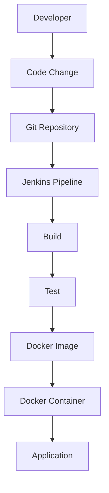
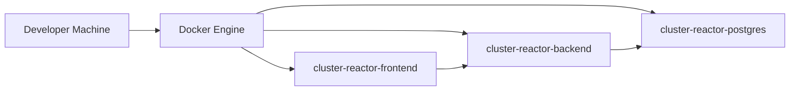
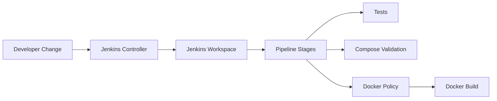
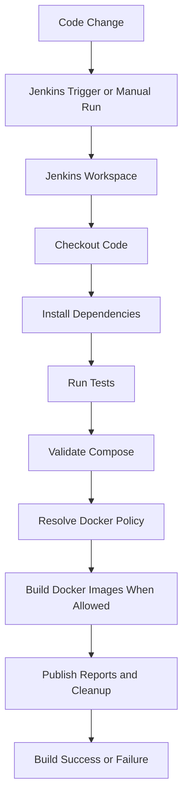
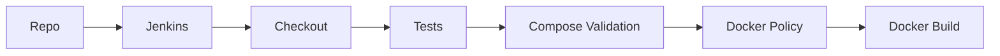

# Cluster Reactor — Docker and Jenkins Journey

> [!abstract]
> This document covers only the **Docker** and **Jenkins** work completed for **Cluster Reactor**.
>
> It is organized to clearly separate:
> 1. **What we actually did**
> 2. **What the current configuration and code do**
> 3. **Recommended practices not yet implemented**
> 4. **Interview knowledge you should know**

---

## Table of Contents

- [1. Project Context](#1-project-context)
- [2. What We Actually Did](#2-what-we-actually-did)
- [3. Docker](#3-docker)
- [4. Docker Troubleshooting](#4-docker-troubleshooting)
- [5. Jenkins](#5-jenkins)
- [6. Jenkins + Docker](#6-jenkins--docker)
- [7. Actual Terminal Command Reference](#7-actual-terminal-command-reference)
- [8. Interview Perspective](#8-interview-perspective)
- [9. What We Have Now vs Production-Grade Implementation](#9-what-we-have-now-vs-production-grade-implementation)
- [10. Final Interview Story](#10-final-interview-story)
- [11. Quick Revision Cheat Sheet](#11-quick-revision-cheat-sheet)

---

# 1. Project Context

## What Cluster Reactor Is

**Cluster Reactor** is a small internal operations console with:

- a Python backend service
- a Python Streamlit frontend service
- a PostgreSQL database
- health and readiness behavior that matters operationally

For this document, the important part is not the business domain itself, but how **Docker** and **Jenkins** were introduced to package, run, and validate the system.

## Why We Introduced Docker

Docker was introduced because the project had grown beyond a single process. Once backend, frontend, and database needed to be coordinated together, manual startup became less reliable and less repeatable.

### What problem Docker solves

Docker solves:

- machine-to-machine environment drift
- inconsistent local runtime setup
- repeated manual startup steps
- the need to package application dependencies and runtime configuration predictably

## Why We Introduced Jenkins

Jenkins was introduced to automate the same validation steps that had been done manually.

### What problem Jenkins solves

Jenkins solves:

- repeated manual test and validation work
- lack of stage-by-stage visibility
- missing CI history
- inconsistent execution of Docker-related checks

## How Docker and Jenkins Fit Together

Docker packages and runs the services.
Jenkins automates build, validation, and Docker-related CI steps.



## High-Level Flow Explained

| Step | Explanation |
|---|---|
| Developer | A developer changes the project code or configuration. |
| Code Change | The new code becomes the candidate version to validate. |
| Git Repository | Jenkins reads pipeline code and source code from the repository. |
| Jenkins Pipeline | Jenkins executes the defined CI stages from `Jenkinsfile`. |
| Build | The environment is prepared and Docker-related work may be performed. |
| Test | Automated verification is run before expensive or downstream steps continue. |
| Docker Image | The application runtime is packaged as an immutable artifact. |
| Docker Container | A running instance is created from an image. |
| Application | The services become reachable on expected ports. |

---

# 2. What We Actually Did

> [!important]
> This section reconstructs the **actual** Docker and Jenkins work from the repository state and confirmed session history.
>
> When an exact command or specific step cannot be proven from the available project history, it is labeled:
>
> **Not confirmed from available project history**

## Chronological Summary

1. Added Docker packaging files for backend and frontend.
2. Added a Compose file for backend, frontend, and PostgreSQL.
3. Added `.dockerignore` and Docker usage notes in `README.md`.
4. Validated Compose configuration with `docker compose config`.
5. Attempted to bring the stack up and hit a Docker daemon availability error.
6. Started Docker Desktop and retried containerized startup successfully.
7. Added a Jenkins pipeline file to the repository.
8. Started Jenkins locally in Docker with persisted state and host Docker access.
9. Retrieved the Jenkins initial admin password from inside the Jenkins container.
10. Installed Blue Ocean and handled restart/plugin access issues.
11. Refined `Jenkinsfile` for Blue Ocean readability and visual test reporting.

---

## Step 1 — Added Docker Support to the Repository

### What we were trying to achieve

Containerize the application so it could be built and run consistently without relying on manually prepared local runtimes.

### Files changed

- `backend/Dockerfile`
- `frontend/Dockerfile`
- `docker-compose.yml`
- `.dockerignore`
- `README.md`

### Why we changed these files

- `backend/Dockerfile` packages the backend service.
- `frontend/Dockerfile` packages the Streamlit frontend.
- `docker-compose.yml` wires backend, frontend, and PostgreSQL together.
- `.dockerignore` reduces build context and avoids copying local junk.
- `README.md` documents how to use the new Docker workflow.

### What we learned

Dockerization is not just about adding a Dockerfile. It usually requires:

- image definitions
- orchestration
- environment wiring
- documentation

---

## Step 2 — Validated Compose Configuration Before Startup

### What we were trying to achieve

Make sure the Compose configuration was valid before attempting to build and run containers.

### Exact command used

```bash
docker compose config
```

### Why we ran the command

It is a low-risk preflight check for `docker-compose.yml`.

### What the command does

- parses the Compose file
- resolves interpolated environment values
- checks structure and syntax
- prints normalized configuration if valid

### Expected output

Valid rendered Compose configuration.

### What actually happened

The Compose file rendered successfully.

### What we learned

`docker compose config` is one of the safest ways to detect orchestration problems early.

---

## Step 3 — Attempted to Start the Dockerized Stack

### What we were trying to achieve

Build and run all services together using Docker Compose.

### Exact command used

```bash
docker compose up --build -d
```

### Why we ran the command

To:

- build the service images
- start all services
- keep them running in the background

### What the command does

- reads `docker-compose.yml`
- builds any service with a `build:` section
- creates networks and volumes if necessary
- starts the declared containers
- detaches because of `-d`

### Expected output

Built images and running containers.

### What actually happened

We encountered a real Docker daemon error:

```text
unable to get image 'cluster-reactor-backend': Cannot connect to the Docker daemon at unix:///Users/hypercode/.docker/run/docker.sock. Is the docker daemon running?
```

### Why the error happened

Docker CLI was available, but the Docker engine/daemon was not running.

### How we fixed it

We started Docker Desktop and retried the Docker workflow.

### What we learned

There is a major difference between:

- Docker CLI being installed
- Docker daemon actually being available

---

## Step 4 — Brought the Docker Stack Up Successfully

### What we were trying to achieve

Confirm the full stack worked once Docker was available.

### Exact confirmed command used

```bash
docker compose up --build -d
```

### Additional validation commands

The following runtime checks are confirmed from session history:

```bash
docker compose ps
curl -fsS http://127.0.0.1:8000/
curl -fsS http://127.0.0.1:8000/readyz
curl -fsS http://127.0.0.1:8501/_stcore/health
```

### Why we ran them

- `docker compose ps` verifies container state
- `curl` checks the backend root endpoint
- `curl` checks backend readiness
- `curl` checks Streamlit health

### What actually happened

All three services were confirmed healthy:

- backend healthy on `8000`
- frontend healthy on `8501`
- postgres healthy on `5432`

### What we learned

Successful container startup should be followed by real endpoint checks, not only container status checks.

---

## Step 5 — Added Jenkins Pipeline Support to the Repo

### What we were trying to achieve

Automate validation in a browser-accessible CI system.

### Files changed

- `Jenkinsfile`
- `README.md`

### Why we changed them

- `Jenkinsfile` defines CI behavior in code
- `README.md` explains how to use Jenkins and Blue Ocean with the project

### What actually happened

The repository now contains a declarative pipeline with:

- checkout
- Python environment setup
- test execution
- Compose validation
- branch-aware Docker policy
- optional Docker build stage
- JUnit publishing
- artifact archiving

### What we learned

Pipeline-as-code makes CI reproducible and reviewable.

---

## Step 6 — Created Persistent Storage for Jenkins

### What we were trying to achieve

Run Jenkins in Docker without losing configuration every time the container restarts or is recreated.

### Exact command used

```bash
docker volume create jenkins_home
```

### Why we ran the command

To create persistent Docker-managed storage for Jenkins.

### What the command does

Creates a named Docker volume called `jenkins_home`.

### Expected output

```text
jenkins_home
```

### What actually happened

That exact volume name was returned.

### What we learned

Persistent volumes are critical for stateful tools like Jenkins.

---

## Step 7 — Started Jenkins as a Docker Container

### What we were trying to achieve

Get a working Jenkins server locally without installing Jenkins directly onto the host OS.

### Exact command used

```bash
docker run -d \
  --name jenkins \
  -p 8080:8080 \
  -p 50000:50000 \
  -v jenkins_home:/var/jenkins_home \
  -v /var/run/docker.sock:/var/run/docker.sock \
  jenkins/jenkins:lts
```

### Why we ran the command

To:

- run Jenkins locally
- expose the Jenkins UI on `8080`
- keep Jenkins state in a volume
- allow Jenkins to talk to the host Docker daemon through the Docker socket

### What the command does

- pulls `jenkins/jenkins:lts` if absent
- creates a detached container
- maps ports
- mounts persistent data
- mounts Docker socket

### Expected output

A container ID.

### What actually happened

Docker first printed:

```text
Unable to find image 'jenkins/jenkins:lts' locally
```

Then it downloaded the image and started the container successfully.

### Why that happened

This was the first local use of the Jenkins image, so Docker had to pull it.

### What we learned

That message is expected the first time an image is used.

---

## Step 8 — Retrieved the Jenkins Initial Admin Password

### What we were trying to achieve

Unlock Jenkins UI after first launch.

### Exact command used

```bash
docker exec jenkins cat /var/jenkins_home/secrets/initialAdminPassword
```

### Why we ran the command

Jenkins requires an initial admin token during first-time setup.

### What the command does

Runs `cat` inside the running Jenkins container and prints the saved initial password file.

### Expected output

A one-line token string.

### What actually happened

We retrieved the real initial admin password from the Jenkins container and used it in the browser.

### What we learned

`docker exec` is one of the most useful commands for operational inspection inside a running container.

---

## Step 9 — Installed Blue Ocean and Hit Plugin/UI Issues

### What we were trying to achieve

Use Jenkins Blue Ocean as a visual CI/CD interface.

### What actually happened first

Visiting:

```text
http://localhost:8080/blue
```

returned `Not Found`.

### Why that happened

Blue Ocean plugin was not yet installed.

### How we fixed it

Installed the top-level `Blue Ocean` plugin through Jenkins plugin management.

### What happened next

After installation, Blue Ocean existed, but unauthenticated access returned `403`.

### Why that happened

The route existed, but Jenkins required an authenticated browser session.

### What we learned

HTTP status codes gave two different troubleshooting signals:

- `404` → feature/plugin missing
- `403` → feature exists, but access is denied

---

## Step 10 — Restart and Recovery Around Jenkins Plugin Installation

### What we were trying to achieve

Complete Blue Ocean installation and get Jenkins back into a clean running state.

### Exact confirmed commands used

```bash
docker restart jenkins
docker start jenkins
docker ps --filter name=jenkins
docker logs --tail 120 jenkins
curl -I -s http://localhost:8080/login
curl -I -s http://localhost:8080/blue/
```

### Why we ran them

- `docker restart jenkins` to restart the Jenkins container
- `docker start jenkins` after the safe restart flow left the container stopped
- `docker ps` to confirm container status
- `docker logs` to inspect plugin installation and restart flow
- `curl` to confirm route availability and distinguish 200/403 behavior

### What actually happened

- Blue Ocean plugin finished installation successfully
- safe restart caused Jenkins to stop inside the container lifecycle
- container had to be started again explicitly
- `/login` returned `200`
- `/blue/` returned `403` for anonymous access, confirming Blue Ocean was installed

### What we learned

When Jenkins itself runs inside Docker, Jenkins-level restart behavior and Docker container lifecycle must both be understood.

---

## Step 11 — Refined the Jenkinsfile for Blue Ocean and Reporting

### What we were trying to achieve

Make the pipeline more useful visually and operationally.

### What actually changed

The current `Jenkinsfile` now includes:

- short, clear stage names for Blue Ocean
- build retention with `buildDiscarder`
- JUnit report publishing
- archived artifacts
- branch-aware Docker build policy
- build display metadata showing branch and Docker decision

### What we learned

CI usability improves when the pipeline is optimized not just for execution, but for visibility.

---

# 3. Docker

## 3.1 Why Docker Was Introduced

Docker was introduced to make Cluster Reactor reproducible and easier to operate.

Without Docker, each developer or environment would need to manage:

- Python versions
- package installation
- backend startup
- frontend startup
- PostgreSQL startup and wiring

Docker consolidates those runtime concerns into image and container definitions.

---

## 3.2 Docker Architecture



### Meaning

- Docker Engine runs on the host machine
- `docker-compose.yml` defines three cooperating services
- frontend talks to backend
- backend talks to PostgreSQL

---

## 3.3 Dockerfile and Docker-Related Files in the Repo

| File | Purpose |
|---|---|
| `backend/Dockerfile` | Builds the backend image |
| `frontend/Dockerfile` | Builds the frontend image |
| `docker-compose.yml` | Defines the multi-container local stack |
| `.dockerignore` | Excludes local junk from Docker build context |
| `README.md` | Documents Docker usage |

---

## 3.4 Backend Dockerfile — Line by Line

Current file:

```dockerfile
FROM python:3.12-slim

ENV PYTHONDONTWRITEBYTECODE=1 \
	PYTHONUNBUFFERED=1 \
	PYTHONPATH=/app/backend

WORKDIR /app

COPY requirements.txt ./requirements.txt
RUN pip install --no-cache-dir --upgrade pip \
	&& pip install --no-cache-dir -r requirements.txt

COPY backend ./backend

EXPOSE 8000

CMD ["uvicorn", "app.main:app", "--host", "0.0.0.0", "--port", "8000"]
```

### `FROM python:3.12-slim`

Uses an official slim Python base image.

**Why**
- small enough for practical builds
- still includes what the app needs
- avoids building a Python runtime manually

### `ENV PYTHONDONTWRITEBYTECODE=1`

Stops Python from writing `.pyc` files.

**Why**
- reduces clutter
- avoids unnecessary generated files inside containers

### `ENV PYTHONUNBUFFERED=1`

Ensures Python writes logs without buffering delays.

**Why**
- useful for container logs
- useful in Jenkins logs

### `ENV PYTHONPATH=/app/backend`

Adds the backend package root to Python's import path inside the container.

**Why**
- allows `uvicorn app.main:app` to import the backend app correctly

### `WORKDIR /app`

Sets the working directory for later commands.

**Why**
- creates a predictable filesystem layout

### `COPY requirements.txt ./requirements.txt`

Copies dependency list into the image before source code.

**Why**
- allows Docker caching to reuse dependency install layers if only source code changes

### `RUN pip install --no-cache-dir --upgrade pip && pip install --no-cache-dir -r requirements.txt`

Installs Python dependencies.

**Why**
- backend needs its runtime packages inside the image
- `--no-cache-dir` avoids retaining pip download cache in the image

### `COPY backend ./backend`

Copies the backend source directory.

**Why**
- application code must exist inside the image to run

### `EXPOSE 8000`

Documents the container's internal application port.

**Why**
- communicates intended runtime port to humans and tooling

### `CMD [...]`

Starts the backend server process.

**Why**
- container must have one primary long-running process
- here that process is `uvicorn`

---

## 3.5 Frontend Dockerfile — Line by Line

Current file:

```dockerfile
FROM python:3.12-slim

ENV PYTHONDONTWRITEBYTECODE=1 \
	PYTHONUNBUFFERED=1 \
	PYTHONPATH=/app \
	CLUSTER_REACTOR_API_URL=http://backend:8000

WORKDIR /app

COPY requirements.txt ./requirements.txt
RUN pip install --no-cache-dir --upgrade pip \
	&& pip install --no-cache-dir -r requirements.txt

COPY frontend ./frontend
COPY .streamlit ./.streamlit

EXPOSE 8501

CMD ["streamlit", "run", "frontend/app.py", "--server.address=0.0.0.0", "--server.port=8501"]
```

### `FROM python:3.12-slim`

Uses the same slim Python base image pattern as the backend.

### `ENV PYTHONDONTWRITEBYTECODE=1`

Disables `.pyc` creation.

### `ENV PYTHONUNBUFFERED=1`

Makes logs appear immediately.

### `ENV PYTHONPATH=/app`

Makes the project package importable from within the container.

### `ENV CLUSTER_REACTOR_API_URL=http://backend:8000`

Points the frontend at the backend service name inside the Compose network.

**Why**
- inside containers, `localhost` would mean the current container, not the backend container

### `WORKDIR /app`

Sets the working directory.

### `COPY requirements.txt ./requirements.txt`

Copies the dependency manifest first for caching benefits.

### `RUN pip install ...`

Installs project dependencies required for Streamlit and shared Python modules.

### `COPY frontend ./frontend`

Copies frontend application code.

### `COPY .streamlit ./.streamlit`

Copies Streamlit configuration.

### `EXPOSE 8501`

Documents the Streamlit port.

### `CMD [...]`

Starts Streamlit bound to all interfaces on port `8501`.

**Why**
- binding to `0.0.0.0` is necessary for access from outside the container

---

## 3.6 Docker Build Context

### What it means

Docker build context is the set of files sent to the daemon during image build.

### In this project

Compose uses:

```yaml
build:
  context: .
```

for backend and frontend.

### Why this matters

Because the repository root is sent as build context, `.dockerignore` is essential to avoid sending:

- `.venv`
- `.git`
- caches
- `.env`
- logs

---

## 3.7 Docker Images

### What they are

Docker images are immutable packaged artifacts built from Dockerfiles.

### In this project

- backend image is built from `backend/Dockerfile`
- frontend image is built from `frontend/Dockerfile`
- PostgreSQL uses official `postgres:16-alpine`

---

## 3.8 Docker Containers

### What they are

Containers are runtime instances created from images.

### In this project

- `cluster-reactor-backend`
- `cluster-reactor-frontend`
- `cluster-reactor-postgres`
- `jenkins` (separate from the app stack)

---

## 3.9 Docker Layers

Every Dockerfile instruction like `COPY` or `RUN` creates layers.

### Why that matters here

The project copies `requirements.txt` before source code so that dependency layers can be reused when source changes but dependencies do not.

---

## 3.10 Docker Networking

Compose creates an internal default network for services.

### Why this matters in Cluster Reactor

- frontend reaches backend via `http://backend:8000`
- backend reaches database via host `postgres`

That networking behavior is visible directly in the environment variables configured in `docker-compose.yml`.

---

## 3.11 Port Mapping

Confirmed mappings in this project:

| Service | Host Port | Container Port |
|---|---:|---:|
| Jenkins | 8080 | 8080 |
| Jenkins agent | 50000 | 50000 |
| Backend | 8000 | 8000 |
| Frontend | 8501 | 8501 |
| PostgreSQL | 5432 | 5432 |

### Key distinction

- **container port** = port used inside the container
- **host port** = port reachable from the laptop/browser

---

## 3.12 Environment Variables

Docker and Compose rely heavily on environment variables here.

### Backend-related examples

- `APP_NAME`
- `APP_VERSION`
- `ENVIRONMENT`
- `DB_HOST`
- `DB_PORT`
- `DB_NAME`
- `DB_USER`
- `DB_PASSWORD`
- `DB_AUTO_CREATE_TABLES`

### Frontend-related examples

- `CLUSTER_REACTOR_API_URL`
- `CLUSTER_REACTOR_API_TIMEOUT`

### Why they matter

They let one image behave differently across environments without modifying code.

---

## 3.13 Container Lifecycle

Common states relevant to this project:

- image pulled
- container created
- container running
- container restarted
- container stopped
- container started again

### Real examples from this project

- Jenkins image was pulled on first run
- Jenkins container was restarted after plugin changes
- Jenkins container had to be explicitly started after the safe restart flow

---

## 3.14 Volumes

### Application stack volume

From `docker-compose.yml`:

```yaml
volumes:
  postgres_data:
```

This persists PostgreSQL data.

### Jenkins volume

Created explicitly:

```bash
docker volume create jenkins_home
```

This persists Jenkins configuration, plugins, and state.

---

## 3.15 `.dockerignore`

Current file:

```text
.git
.gitignore
.pytest_cache
.venv
__pycache__
**/__pycache__
**/*.pyc
**/*.pyo
**/*.pyd
.DS_Store
.env
.env.*
*.log
postgres_data
```

### Why each type matters

- `.git` and `.gitignore` are not needed in images
- `.venv` is local-only and very large
- cache and compiled Python artifacts do not belong in build context
- `.env` files may contain sensitive local config
- logs and local postgres data do not belong in images

---

## 3.16 Dependency Installation

Both Dockerfiles install dependencies from `requirements.txt`.

### Why

This ensures the runtime image is self-contained and does not depend on host-installed Python packages.

---

## 3.17 How the Python Application Runs Inside the Container

### Backend

Runs via:

```dockerfile
CMD ["uvicorn", "app.main:app", "--host", "0.0.0.0", "--port", "8000"]
```

### Frontend

Runs via:

```dockerfile
CMD ["streamlit", "run", "frontend/app.py", "--server.address=0.0.0.0", "--server.port=8501"]
```

### Why this matters

The container stays alive as long as its main process stays alive.

---

## 3.18 How the Containers Are Started

### Application stack

```bash
docker compose up --build -d
```

### Jenkins

```bash
docker run -d --name jenkins ... jenkins/jenkins:lts
```

---

## 3.19 How to Verify Containers Are Working

### What we actually used

- `docker compose config`
- `docker compose up --build -d`
- `docker compose ps`
- `curl -fsS http://127.0.0.1:8000/`
- `curl -fsS http://127.0.0.1:8000/readyz`
- `curl -fsS http://127.0.0.1:8501/_stcore/health`
- `docker ps --filter name=jenkins`
- `docker logs --tail ... jenkins`

### Verification levels

1. **Configuration valid**
2. **Container running**
3. **Application endpoints responding**
4. **Health/readiness indicating success**

---

## 3.20 Docker Commands We Actually Used

| Command | What It Does | Why We Used It | Expected Output | Interview Explanation |
|---|---|---|---|---|
| `docker compose config` | Validates and renders Compose configuration | Check `docker-compose.yml` before runtime | Normalized config | Safe way to catch orchestration issues early |
| `docker compose up --build -d` | Builds and starts services in background | Launch full local stack | Running services | Standard way to build and run multi-service apps |
| `docker compose ps` | Shows service/container status | Confirm health and state | Running/healthy statuses | Useful runtime verification step |
| `docker volume create jenkins_home` | Creates named persistent volume | Preserve Jenkins state | Volume name | Named volumes survive container recreation |
| `docker run -d --name jenkins ... jenkins/jenkins:lts` | Starts Jenkins container | Run Jenkins locally | Container ID | Launches local CI server in Docker |
| `docker exec jenkins cat /var/jenkins_home/secrets/initialAdminPassword` | Executes command inside running container | Retrieve initial Jenkins password | Token string | Common operational admin pattern |
| `docker restart jenkins` | Restarts container | Recover after plugin setup/restart issues | Container name | Useful when service needs restart without recreation |
| `docker start jenkins` | Starts existing stopped container | Bring Jenkins back after safe restart stopped it | Container name | Useful when container exists but is not running |
| `docker ps --filter name=jenkins` | Lists running containers matching filter | Confirm Jenkins runtime state | Running container row | Quick operational status check |
| `docker logs --tail 120 jenkins` | Shows recent container logs | Investigate plugin install and restart flow | Recent log lines | Key troubleshooting command |

---

## 3.21 Additional Interview Knowledge

> [!tip]
> These commands are important to know even if we did not personally execute all of them here.

| Command | What It Does |
|---|---|
| `docker build -t name .` | Builds an image from a Dockerfile |
| `docker images` | Lists local images |
| `docker run` | Creates and starts a new container |
| `docker ps` | Lists running containers |
| `docker ps -a` | Lists all containers including stopped |
| `docker stop <id>` | Stops a running container |
| `docker start <id>` | Starts an existing container |
| `docker rm <id>` | Removes a container |
| `docker rmi <image>` | Removes an image |
| `docker exec -it <container> sh` | Opens shell inside running container |
| `docker inspect <object>` | Shows low-level metadata |
| `docker pull <image>` | Pulls image from registry |
| `docker push <image>` | Pushes image to registry |
| `docker tag src dst` | Adds or changes image tag |
| `docker system prune` | Cleans unused Docker resources |

---

## 3.22 Important Docker Differences

### Image vs Container

| Term | Meaning |
|---|---|
| Image | Immutable packaged artifact |
| Container | Runtime instance created from the image |

### Dockerfile vs Image

| Term | Meaning |
|---|---|
| Dockerfile | Recipe/instructions |
| Image | Result of the recipe |

### COPY vs ADD

| Instruction | Meaning |
|---|---|
| `COPY` | Simple file copy; preferred in most cases |
| `ADD` | Extra behavior like archive extraction; often unnecessary |

### CMD vs ENTRYPOINT

| Instruction | Meaning |
|---|---|
| `CMD` | Default runtime command/arguments |
| `ENTRYPOINT` | Fixed primary executable behavior |

### RUN vs CMD

| Instruction | When It Happens |
|---|---|
| `RUN` | During image build |
| `CMD` | When container starts |

### EXPOSE vs Published Port

| Concept | Meaning |
|---|---|
| `EXPOSE 8000` | Image metadata/documentation |
| `ports: "8000:8000"` | Real host publication |

### Container Port vs Host Port

- Container port is internal to the container
- Host port is what your browser or local machine reaches

### Docker Volume vs Bind Mount

| Type | Meaning |
|---|---|
| Docker volume | Docker-managed persistent storage |
| Bind mount | Host filesystem path mounted directly |

### Build Time vs Runtime

| Phase | Meaning |
|---|---|
| Build time | Image is being created |
| Runtime | Container is being executed |

---

# 4. Docker Troubleshooting

> [!warning]
> This section clearly separates **real problems we actually hit** from **general problems you should know for interviews**.

## Real Problem 1 — Docker Daemon Not Running

### Problem

Compose startup failed.

### Symptoms

```text
unable to get image 'cluster-reactor-backend': Cannot connect to the Docker daemon at unix:///Users/hypercode/.docker/run/docker.sock. Is the docker daemon running?
```

### Investigation

The error referenced Docker's Unix socket rather than any application build step.

### Command used

```bash
docker compose up --build -d
```

### Root cause

Docker daemon was not running.

### Fix

Started Docker Desktop, then retried.

### Prevention

Run `docker info` before troubleshooting deeper container issues.

---

## Real Problem 2 — Jenkins Image Not Present Locally

### Problem

Jenkins image was not available on the machine.

### Symptoms

```text
Unable to find image 'jenkins/jenkins:lts' locally
```

### Investigation

This appeared immediately on first `docker run`.

### Root cause

No local copy of the image existed yet.

### Fix

Waited for Docker to pull the image.

### Prevention

None needed. This is normal first-run behavior.

---

## Real Problem 3 — Blue Ocean Returned `Not Found`

### Problem

Blue Ocean path did not exist.

### Symptoms

Browser showed `Not Found` at `/blue`.

### Investigation

Jenkins itself was reachable, which suggested the base server was healthy.

### Root cause

Blue Ocean plugin was not installed.

### Fix

Installed `Blue Ocean` from Jenkins plugin management.

### Prevention

Confirm required plugins after first Jenkins bootstrap.

---

## Real Problem 4 — Jenkins Restart/Plugin Flow Left Container Stopped

### Problem

Jenkins plugin install triggered restart behavior that looked stuck.

### Symptoms

- restart UI appeared to take a long time
- container was no longer running

### Investigation

Used `docker ps`, `docker logs`, and plugin-related checks.

### Commands used

```bash
docker ps --filter name=jenkins
docker logs --tail 120 jenkins
docker start jenkins
```

### Root cause

Jenkins performed a safe restart, and because it was running inside Docker without a restart policy, the container stopped and had to be started again.

### Fix

Started the container again explicitly.

### Prevention

Understand that application restarts and container restarts are different layers.

---

## Real Problem 5 — Blue Ocean Returned `403`

### Problem

Blue Ocean existed but could not be viewed anonymously.

### Symptoms

`curl -I http://localhost:8080/blue/` returned `403 Forbidden`.

### Investigation

`/login` returned `200` while `/blue/` returned `403`, indicating route existence with access denial.

### Root cause

Jenkins required authentication.

### Fix

Log into Jenkins in the browser, then open `/blue/`.

### Prevention

Use authenticated session when opening restricted Jenkins routes.

---

## Common Docker Problems You Should Know

> [!tip]
> These were not all encountered in this project. They are included as additional interview and production knowledge.

| Problem | Typical Cause | Quick Fix |
|---|---|---|
| Container exits immediately | Main process crashes or completes | Check `docker logs` |
| Port already in use | Host port collision | Change port mapping or stop conflict |
| Image build failure | Bad Dockerfile or dependency issue | Inspect failing build layer logs |
| App cannot connect to another container | Wrong hostname/network | Use Compose service name |
| Wrong environment variables | Missing or bad config | Check `environment:` and app expectations |
| Docker cache confusion | Stale cached layers | Rebuild with `--no-cache` when needed |
| Permission problems | User/group or socket mismatch | Inspect permissions and runtime user |
| Large images | Too much copied or heavy base image | Use `.dockerignore` and multi-stage builds |

---

# 5. Jenkins

## 5.1 Why Jenkins Was Introduced

Jenkins was introduced to turn manual validation steps into a repeatable CI workflow.

### Why that mattered here

Once Docker was in place, the next need was consistent automated validation of:

- source checkout
- dependency install
- tests
- Compose validation
- Docker build behavior

---

## 5.2 What CI Means

**CI** means **Continuous Integration**.

In this project, CI means that code changes can be validated through a repeatable pipeline.

### What CI means specifically for Cluster Reactor

- checkout the code
- prepare Python environment
- run tests
- validate Docker Compose configuration
- optionally build Docker artifacts depending on branch policy

---

## 5.3 What CD Means

**CD** can mean:

- Continuous Delivery
- Continuous Deployment

### In this project

Full CD is **not implemented yet**.

There is no confirmed pipeline stage that pushes images to a registry or deploys them to a runtime platform.

---

## 5.4 What CI/CD Means in Our Project

The project currently implements:

- solid **CI**
- Docker build-aware automation

The project does **not yet** implement complete deployment automation.

---

## 5.5 Jenkins Architecture



### Key Concepts

| Term | Meaning |
|---|---|
| Jenkins controller | Main Jenkins server and UI |
| Jenkins agent | Executor that runs stages |
| Workspace | Checked-out repo directory for a build |
| Job | Configured Jenkins automation unit |
| Pipeline | Code-defined staged workflow |
| Jenkinsfile | The pipeline definition stored in the repo |

---

## 5.6 Jenkins Controller

In this project, Jenkins runs locally as a Docker container.

### Why that matters

- quick local bootstrap
- isolated Jenkins runtime
- easy persistence through Docker volume

---

## 5.7 Jenkins Agents

### Current state

A separate dedicated external agent model is **not confirmed from available project history**.

### Practical meaning

For the current local setup, Jenkins runs the pipeline through the environment available to that local Jenkins container setup.

---

## 5.8 Jenkins Workspace

The Jenkins workspace is where the repository is checked out and commands run.

### Why it matters

The build should depend on the checked-out repository, not arbitrary host machine directories.

---

## 5.9 Jenkins Jobs

The intended job type for the project is a **Pipeline** or **Multibranch Pipeline**.

### Why

- works well with `Jenkinsfile`
- works well with Blue Ocean
- supports branch-specific pipeline behavior

---

## 5.10 Jenkins Pipelines

A Jenkins pipeline is a staged automation workflow defined as code.

### Why we used it

To keep CI logic:

- version-controlled
- inspectable
- reproducible

---

## 5.11 Jenkinsfile

Current file behavior is defined in `Jenkinsfile` at the repository root.

It is a **Declarative Pipeline**.

---

## 5.12 Declarative vs Scripted Pipeline

### What this project uses

Declarative pipeline.

### Why declarative was a good fit here

- easier to read
- cleaner stage structure
- better default fit for Blue Ocean visualization

| Style | Meaning |
|---|---|
| Declarative | Structured, concise, easier for most teams |
| Scripted | More flexible but more complex |

---

## 5.13 Pipeline Stages

Current stage names in the repo are:

- `Checkout`
- `Python Env`
- `Pytest`
- `Compose Config`
- `Docker Policy`
- `Docker Build`

### Why stage separation matters

Each stage isolates one type of concern and makes failures easier to locate visually.

---

## 5.14 Build Triggers

### Confirmed implemented state

Manual execution from Jenkins UI and Blue Ocean is confirmed.

### Not confirmed from available project history

- Git webhooks
- SCM polling schedule

These are not claimed as implemented here.

---

## 5.15 Webhooks

### Current state

Not confirmed as implemented.

### Recommended knowledge

A webhook allows Git hosting to notify Jenkins immediately when code changes are pushed.

---

## 5.16 Polling

### Current state

Not confirmed as implemented.

### Recommended knowledge

Jenkins can poll source control on an interval, but webhooks are generally more efficient.

---

## 5.17 Credentials

### Current state

Advanced Jenkins credential management was not a major implemented part of the current work.

### What is confirmed

- local admin setup
- Blue Ocean and Jenkins login flow

### Recommended next step

Use Jenkins Credentials for:

- private repository authentication
- Docker registry authentication
- secret environment variables

---

## 5.18 Environment Variables

Environment variables are used in the pipeline to control behavior.

### Current confirmed examples

- `RUN_DOCKER_BUILD` parameter
- `VENV_DIR`
- `PYTHON_BIN`
- `PIP_BIN`
- `REPORTS_DIR`
- branch-related variables such as `BRANCH_NAME` or `GIT_BRANCH`

---

## 5.19 Build Artifacts

Current confirmed artifact behavior in `Jenkinsfile`:

- JUnit test report publishing from `reports/pytest.xml`
- archived artifacts:
  - `README.md`
  - `docker-compose.yml`
  - `Jenkinsfile`
  - `reports/**`

---

## 5.20 Build Logs

### Why they matter

Logs are the first place to inspect failures.

### In classic Jenkins

Console logs show the full command output.

### In Blue Ocean

Logs are grouped by stage and easier to inspect visually.

---

## 5.21 Jenkinsfile — Section-by-Section Explanation

Current file:

```groovy
pipeline {
	agent any

	options {
		timestamps()
		disableConcurrentBuilds()
		buildDiscarder(logRotator(numToKeepStr: '20'))
	}

	parameters {
		booleanParam(
			name: 'RUN_DOCKER_BUILD',
			defaultValue: false,
			description: 'Build the Docker Compose stack after tests pass.'
		)
	}

	environment {
		VENV_DIR = '.venv-jenkins'
		PYTHON_BIN = "${WORKSPACE}/.venv-jenkins/bin/python"
		PIP_BIN = "${WORKSPACE}/.venv-jenkins/bin/pip"
		REPORTS_DIR = 'reports'
	}

	stages {
		stage('Checkout') {
			steps {
				checkout scm
			}
		}

		stage('Python Env') {
			steps {
				sh '''
					set -eu
					mkdir -p "$REPORTS_DIR"
					python3 -m venv "$VENV_DIR"
					"$PIP_BIN" install --upgrade pip
					"$PIP_BIN" install -r requirements.txt
				'''
			}
		}

		stage('Pytest') {
			steps {
				sh '''
					set -eu
					"$PYTHON_BIN" -m pytest -q --junitxml="$REPORTS_DIR/pytest.xml"
				'''
			}
		}

		stage('Compose Config') {
			steps {
				sh '''
					set -eu
					if ! command -v docker >/dev/null 2>&1; then
						echo "Docker CLI not installed on agent; failing Compose validation."
						exit 1
					fi
					docker compose config >"$REPORTS_DIR/docker-compose.rendered.yaml"
					test -s "$REPORTS_DIR/docker-compose.rendered.yaml"
				'''
			}
		}

		stage('Docker Policy') {
			steps {
				script {
					def branchName = env.BRANCH_NAME ?: env.GIT_BRANCH ?: 'detached'
					def autoBuildBranch = branchName == 'main' || branchName == 'develop' || branchName ==~ /^release\/.*$/
					env.EFFECTIVE_BRANCH_NAME = branchName
					env.AUTO_DOCKER_BUILD = autoBuildBranch ? 'true' : 'false'
					env.SHOULD_RUN_DOCKER_BUILD = (autoBuildBranch || params.RUN_DOCKER_BUILD) ? 'true' : 'false'
					currentBuild.displayName = "#${env.BUILD_NUMBER} ${env.EFFECTIVE_BRANCH_NAME}"
					currentBuild.description = "docker-build=${env.SHOULD_RUN_DOCKER_BUILD} auto-branch=${env.AUTO_DOCKER_BUILD}"

					echo "Branch detected: ${env.EFFECTIVE_BRANCH_NAME}"
					echo "Automatic Docker build branch: ${env.AUTO_DOCKER_BUILD}"
					echo "Docker build stage enabled: ${env.SHOULD_RUN_DOCKER_BUILD}"
				}
			}
		}

		stage('Docker Build') {
			when {
				expression { return env.SHOULD_RUN_DOCKER_BUILD == 'true' }
			}
			steps {
				sh '''
					set -eu
					docker info >/dev/null 2>&1
					docker compose build
				'''
			}
		}
	}

	post {
		always {
			junit testResults: 'reports/pytest.xml', allowEmptyResults: true
			archiveArtifacts artifacts: 'README.md,docker-compose.yml,Jenkinsfile,reports/**', onlyIfSuccessful: false
			sh '''
				if command -v docker >/dev/null 2>&1; then
					docker compose down --volumes --remove-orphans >/dev/null 2>&1 || true
				fi
				rm -rf "$VENV_DIR"
			'''
		}
	}
}
```

### `pipeline { agent any }`

Defines a Jenkins declarative pipeline that can run on any available executor.

**Why it exists**
- gives Jenkins the overall pipeline structure

### `options { timestamps() disableConcurrentBuilds() buildDiscarder(...) }`

Adds useful pipeline behavior:

- `timestamps()` adds timestamps to logs
- `disableConcurrentBuilds()` prevents overlapping runs of the same job
- `buildDiscarder(...)` limits retained builds

**Why these matter**
- easier debugging
- avoids accidental concurrent conflicts
- controls Jenkins storage growth

### `parameters { booleanParam(...) }`

Defines `RUN_DOCKER_BUILD`.

**Why it exists**
- lets users force Docker builds on branches where they are not automatic

### `environment { ... }`

Defines reusable environment values.

**Why it exists**
- centralizes paths
- avoids repeating long Python paths
- defines the reports directory for test and Compose outputs

### Stage: `Checkout`

**What it does**
- checks out repo code into the Jenkins workspace

**Why it exists**
- all later steps require the source code

**What happens if it fails**
- pipeline stops immediately

**Likely interviewer question**
- Why keep pipeline in the repo?

**Strong answer**
- Pipeline-as-code keeps CI logic versioned and reviewable.

### Stage: `Python Env`

**What it does**
- creates a temporary virtual environment
- creates report directory
- upgrades pip
- installs dependencies from `requirements.txt`

**Why it exists**
- creates a predictable isolated execution environment

**What happens internally**
- `python3 -m venv` creates isolated Python tooling
- `pip install` downloads and installs dependencies into that venv

**What happens if it fails**
- tests cannot run
- Docker-related logic should not continue

**Likely interviewer question**
- Why not rely on preinstalled packages on the Jenkins node?

**Strong answer**
- Reproducibility and isolation are more important than convenience.

### Stage: `Pytest`

**What it does**
- runs the Python test suite
- emits JUnit XML into `reports/pytest.xml`

**Why it exists**
- fail fast before heavier steps
- produce structured test results for Jenkins UI

**What happens internally**
- pytest executes tests
- JUnit XML is written for Jenkins publishing

**What happens if it fails**
- pipeline fails
- later stages stop

**Likely interviewer question**
- Why publish JUnit XML?

**Strong answer**
- It gives Jenkins structured, visual test reporting instead of raw logs only.

### Stage: `Compose Config`

**What it does**
- verifies Docker CLI exists
- runs `docker compose config`
- writes rendered Compose output to `reports/docker-compose.rendered.yaml`

**Why it exists**
- validates orchestration separately from application tests

**What happens internally**
- shell checks for Docker
- Compose file is parsed and rendered

**What happens if it fails**
- pipeline fails before Docker build stage

**Likely interviewer question**
- Why validate Compose if code tests already passed?

**Strong answer**
- Container orchestration can be broken even when the application code is fine.

### Stage: `Docker Policy`

**What it does**
- detects branch name
- determines whether Docker build should run automatically
- sets build metadata for UI visibility

**Why it exists**
- branch-aware CI policy controls cost and rigor
- Blue Ocean becomes easier to read with build name/description

**What happens internally**
- branch name is taken from `BRANCH_NAME` or `GIT_BRANCH`
- `main`, `develop`, and `release/*` auto-enable Docker build
- manual parameter can still force build elsewhere

**What happens if it fails**
- pipeline fails before Docker build decision is usable

**Likely interviewer question**
- Why branch-aware Docker build logic?

**Strong answer**
- Important branches deserve stricter automated artifact validation; feature branches can stay faster by default.

### Stage: `Docker Build`

**What it does**
- runs only if policy allows
- checks Docker daemon availability with `docker info`
- runs `docker compose build`

**Why it exists**
- validates that the app is actually buildable as containers

**What happens internally**
- daemon check verifies Docker availability
- Compose build builds backend and frontend images

**What happens if it fails**
- pipeline fails even if tests passed

**Likely interviewer question**
- Why can Docker build fail after tests pass?

**Strong answer**
- Packaging/runtime dependencies and test correctness are different concerns.

### `post { always { ... } }`

**What it does**
- always publishes JUnit results
- archives artifacts
- brings Compose resources down if Docker exists
- removes the temporary virtual environment

**Why it exists**
- cleanup and reporting should happen even on failure

**Likely interviewer question**
- Why use `post always`?

**Strong answer**
- Because test reports and cleanup are needed regardless of success or failure.

---

## 5.22 Build Triggers, Webhooks, Polling, and Credentials

### Actually implemented

- manual Jenkins UI / Blue Ocean execution

### Not confirmed from available project history

- webhook trigger configuration
- SCM polling configuration
- Jenkins credentials store usage for registries or private repos

### Why they still matter conceptually

- **webhooks** trigger builds immediately on source updates
- **polling** gives fallback automation but is less efficient
- **credentials** are essential for production-safe secret handling

---

## 5.23 Blue Ocean Notes

### What Blue Ocean adds

- visual stage graph
- per-stage live logs
- easier branch/run navigation
- cleaner pipeline browsing

### What actually happened here

1. `/blue` returned `404` before plugin install
2. Blue Ocean plugin was installed
3. restart flow created Jenkins/container lifecycle confusion
4. `/blue/` returned `403` for anonymous access, proving plugin presence
5. authenticated access then became the correct next step

---

# 6. Jenkins + Docker

> [!important]
> This is the most important integration section.

## 6.1 What Is Actually Implemented

### Implemented

- Jenkins runs in Docker
- Jenkins state is persisted with `jenkins_home`
- Jenkins can access host Docker via `/var/run/docker.sock`
- pipeline validates Compose configuration
- pipeline can build Docker artifacts when policy allows
- pipeline publishes test results for UI visibility

### Recommended Next Step

Not confirmed as implemented yet:

- run the full application stack inside the Jenkins pipeline
- run endpoint smoke tests against containers started by the pipeline
- push images to a registry
- version images by branch/build/SHA

---

## 6.2 Complete Current Pipeline Flow



### Important distinction

The following steps were requested conceptually, but are **not confirmed as fully implemented** in the current pipeline:

- run full containers in pipeline
- validate live application endpoints from within pipeline

These belong under **Recommended Next Step** rather than current facts.

---

## 6.3 Where Docker Runs

Docker commands run where Jenkins has Docker access.

### In this project

Jenkins itself runs inside a Docker container, but Docker commands are sent to the **host Docker daemon** via the mounted socket.

---

## 6.4 Who Executes Docker Commands

The Jenkins pipeline shell steps execute Docker commands.

### Internally

- Jenkins starts a shell step
- shell step calls Docker CLI
- Docker CLI talks to the host Docker daemon

---

## 6.5 How Jenkins Accesses Docker

Confirmed in the command used to start Jenkins:

```bash
-v /var/run/docker.sock:/var/run/docker.sock
```

### Meaning

The Docker socket from the host is mounted into Jenkins.

### Result

Jenkins can control host Docker.

---

## 6.6 Docker Socket Considerations

### Benefit

Very simple local CI setup.

### Security implication

Anyone controlling Jenkins can potentially control host Docker strongly.

This is a serious production consideration.

---

## 6.7 Jenkins User Permissions

Common Docker-related Jenkins problems include:

- Docker daemon not running
- Docker socket not mounted
- Docker CLI not available
- permission mismatch for the Docker socket

In this project, Docker availability and route/plugin issues were the real problems we saw.

---

## 6.8 Docker-in-Docker vs Docker-outside-of-Docker

| Pattern | Meaning |
|---|---|
| Docker-in-Docker | A Docker daemon runs inside the Jenkins container |
| Docker-outside-of-Docker | Jenkins container talks to the host daemon through the mounted socket |

### What this project uses

**Docker-outside-of-Docker**

### Why

It is simpler for a local learning setup and avoids managing a second daemon.

---

## 6.9 Security Implications

### Current setup

Appropriate for local learning and experimentation.

### Production concern

Docker socket exposure should be treated carefully because it effectively grants strong Docker host control.

### Better production patterns

- isolated agents
- tighter permission boundaries
- remote builders
- minimal privilege execution
- secure credential handling

---

# 7. Actual Terminal Command Reference

## 7.1 Commands We Actually Ran

### COMMAND
`docker compose config`

**PURPOSE:** Validate `docker-compose.yml` before runtime

**WHY WE RAN IT:** Safer preflight validation before starting containers

**WHAT IT DOES INTERNALLY:** Parses Compose YAML, resolves environment references, renders normalized config

**EXPECTED OUTPUT:** Valid rendered Compose configuration

**WHAT WE ACTUALLY SAW:** Successful config rendering

**COMMON ERROR:** YAML indentation or invalid service definition

**HOW TO TROUBLESHOOT:** Check Compose syntax, interpolation, and service keys

**INTERVIEW ANSWER:** It validates Docker Compose configuration before trying to run containers.

---

### COMMAND
`docker compose up --build -d`

**PURPOSE:** Build and run the full application stack

**WHY WE RAN IT:** Start backend, frontend, and postgres together

**WHAT IT DOES INTERNALLY:** Builds images, creates networks/volumes, starts services, detaches terminal

**EXPECTED OUTPUT:** Running services in the background

**WHAT WE ACTUALLY SAW:** First a daemon connection error, then successful startup once Docker was running

**COMMON ERROR:** Docker daemon unavailable

**HOW TO TROUBLESHOOT:** Run `docker info`, start Docker Desktop, retry

**INTERVIEW ANSWER:** Standard multi-service startup command with build and detached execution.

---

### COMMAND
`docker compose ps`

**PURPOSE:** Inspect service status

**WHY WE RAN IT:** Confirm container health and runtime state after Compose startup

**WHAT IT DOES INTERNALLY:** Queries Compose-managed service status

**EXPECTED OUTPUT:** Up/healthy state per service

**WHAT WE ACTUALLY SAW:** Backend, frontend, and postgres healthy

**COMMON ERROR:** Services exited or unhealthy

**HOW TO TROUBLESHOOT:** Check service logs, healthchecks, and dependent service connectivity

**INTERVIEW ANSWER:** Useful to distinguish whether a problem is build-time, startup-time, or runtime health related.

---

### COMMAND
`docker volume create jenkins_home`

**PURPOSE:** Create persistent storage for Jenkins

**WHY WE RAN IT:** Preserve Jenkins state across container restarts and recreation

**WHAT IT DOES INTERNALLY:** Creates Docker-managed named volume metadata and storage

**EXPECTED OUTPUT:** `jenkins_home`

**WHAT WE ACTUALLY SAW:** `jenkins_home`

**COMMON ERROR:** Docker unavailable

**HOW TO TROUBLESHOOT:** Ensure Docker daemon is running

**INTERVIEW ANSWER:** Named volumes are the standard persistence mechanism for stateful containers.

---

### COMMAND
`docker run -d --name jenkins -p 8080:8080 -p 50000:50000 -v jenkins_home:/var/jenkins_home -v /var/run/docker.sock:/var/run/docker.sock jenkins/jenkins:lts`

**PURPOSE:** Start Jenkins locally as a Docker container

**WHY WE RAN IT:** Bootstrap a local CI server quickly with persistence and Docker access

**WHAT IT DOES INTERNALLY:** Pulls image if needed, creates container, maps ports, mounts data and socket

**EXPECTED OUTPUT:** Container ID

**WHAT WE ACTUALLY SAW:** Initial image-pull notice, then successful container startup

**COMMON ERROR:** Port conflict, Docker unavailable, long first image pull

**HOW TO TROUBLESHOOT:** Check `docker ps`, `docker logs`, and host port usage

**INTERVIEW ANSWER:** This runs Jenkins in Docker with persisted state and Docker daemon access.

---

### COMMAND
`docker exec jenkins cat /var/jenkins_home/secrets/initialAdminPassword`

**PURPOSE:** Retrieve Jenkins initial admin password

**WHY WE RAN IT:** Unlock Jenkins during first browser setup

**WHAT IT DOES INTERNALLY:** Executes `cat` inside the running Jenkins container

**EXPECTED OUTPUT:** One-line secret token

**WHAT WE ACTUALLY SAW:** Real initial admin password token

**COMMON ERROR:** Container not running

**HOW TO TROUBLESHOOT:** Start Jenkins and retry

**INTERVIEW ANSWER:** `docker exec` is a common operational command for inspecting or administering running containers.

---

### COMMAND
`docker restart jenkins`

**PURPOSE:** Restart Jenkins container

**WHY WE RAN IT:** Recover after plugin installation/restart confusion

**WHAT IT DOES INTERNALLY:** Stops and restarts the same container instance

**EXPECTED OUTPUT:** Container name

**WHAT WE ACTUALLY SAW:** Jenkins runtime state changed and needed re-verification afterward

**COMMON ERROR:** Container missing or already stopped unexpectedly

**HOW TO TROUBLESHOOT:** Use `docker ps -a` and `docker start jenkins` if needed

**INTERVIEW ANSWER:** Restart helps refresh service state while keeping the same container identity and mounted state.

---

### COMMAND
`docker start jenkins`

**PURPOSE:** Start a stopped Jenkins container

**WHY WE RAN IT:** Jenkins safe restart flow had left the Docker container stopped

**WHAT IT DOES INTERNALLY:** Starts an existing container without recreating it

**EXPECTED OUTPUT:** Container name

**WHAT WE ACTUALLY SAW:** Jenkins container returned to running state

**COMMON ERROR:** Container not found

**HOW TO TROUBLESHOOT:** Use `docker ps -a` to verify existence first

**INTERVIEW ANSWER:** `docker start` is for existing stopped containers, unlike `docker run`, which creates new ones.

---

### COMMAND
`docker ps --filter name=jenkins`

**PURPOSE:** Check Jenkins container runtime state

**WHY WE RAN IT:** Confirm whether Jenkins was running during restart troubleshooting

**WHAT IT DOES INTERNALLY:** Lists running containers matching a filter

**EXPECTED OUTPUT:** Running `jenkins` container row

**WHAT WE ACTUALLY SAW:** At different times, either no running Jenkins container or a running container with mapped ports

**COMMON ERROR:** Empty output when container is stopped

**HOW TO TROUBLESHOOT:** Use `docker ps -a` and `docker start`

**INTERVIEW ANSWER:** This is a fast way to verify whether a service is alive at the container layer.

---

### COMMAND
`docker logs --tail 120 jenkins`

**PURPOSE:** Inspect recent Jenkins logs

**WHY WE RAN IT:** Diagnose plugin installation, restart behavior, and route readiness

**WHAT IT DOES INTERNALLY:** Streams stored container stdout/stderr history

**EXPECTED OUTPUT:** Recent Jenkins log lines

**WHAT WE ACTUALLY SAW:** Plugin installation progress, restart scheduling, and Jenkins stop/start lifecycle logs

**COMMON ERROR:** Container not running or no such container

**HOW TO TROUBLESHOOT:** Verify container existence and rerun logs command

**INTERVIEW ANSWER:** Container logs are one of the first operational tools for runtime troubleshooting.

---

## 7.2 Important Commands We Should Know for Interviews

> [!tip]
> These are important operational commands even if we did not all run them directly.

### Docker commands

- `docker build`
- `docker images`
- `docker run`
- `docker ps`
- `docker ps -a`
- `docker stop`
- `docker start`
- `docker restart`
- `docker rm`
- `docker rmi`
- `docker logs`
- `docker exec`
- `docker inspect`
- `docker pull`
- `docker push`
- `docker tag`
- `docker system prune`

### Jenkins operational concepts

- rerun failed build
- view Blue Ocean stage logs
- configure multibranch pipeline
- install plugins
- inspect workspace
- manage credentials
- publish and inspect test results

---

# 8. Interview Perspective

> [!important]
> The questions below are based specifically on the Docker and Jenkins implementation in Cluster Reactor.

## A. Basic Docker

### 1. Why did you use Docker?
**Short answer:** To package the app consistently and run backend, frontend, and database together.  
**Detailed explanation:** Cluster Reactor had multiple cooperating services, so Docker reduced machine-specific setup problems and made runtime behavior reproducible.  
**Likely follow-up:** Why not run everything directly on the machine?  
**Strong follow-up answer:** Local-only setup works initially, but Docker removes drift and makes CI integration easier.

### 2. What is the difference between an image and a container?
**Short answer:** An image is the packaged template; a container is a running instance of it.  
**Detailed explanation:** Images are immutable artifacts. Containers are created from images at runtime and can start, stop, and be removed.  
**Likely follow-up:** Can many containers use one image?  
**Strong follow-up answer:** Yes, one image can back multiple independent containers.

### 3. What does a Dockerfile do?
**Short answer:** It defines how to build an image.  
**Detailed explanation:** It specifies the base image, files to copy, dependencies to install, ports to expose, and the default process.  
**Likely follow-up:** Is it runtime state?  
**Strong follow-up answer:** No, it is the recipe for creating the runtime artifact.

### 4. Why use `.dockerignore`?
**Short answer:** To reduce build context and avoid copying junk or secrets.  
**Detailed explanation:** It keeps `.venv`, `.git`, cache files, `.env`, and logs out of Docker builds.  
**Likely follow-up:** Why does that matter?  
**Strong follow-up answer:** Smaller context makes builds faster and reduces accidental leakage.

### 5. What does `docker compose up --build -d` do?
**Short answer:** Builds images and starts services in the background.  
**Detailed explanation:** It reads `docker-compose.yml`, builds services with Dockerfiles, creates resources, and launches containers in detached mode.  
**Likely follow-up:** Why include `--build`?  
**Strong follow-up answer:** To ensure the images reflect current code and config.

## B. Advanced Docker

### 6. What is Docker build context?
**Short answer:** The file set sent to the Docker daemon during build.  
**Detailed explanation:** Docker can only `COPY` files from the declared context, which is why `.dockerignore` matters.  
**Likely follow-up:** Why is `.dockerignore` so important with `context: .`?  
**Strong follow-up answer:** Because sending the whole repo without exclusions can be slow and risky.

### 7. What is the difference between `RUN` and `CMD`?
**Short answer:** `RUN` happens at build time; `CMD` happens at container start.  
**Detailed explanation:** `RUN` creates image layers, while `CMD` defines the default runtime command.  
**Likely follow-up:** What happens if the `CMD` process exits?  
**Strong follow-up answer:** The container stops.

### 8. What is the difference between `EXPOSE` and publishing a port?
**Short answer:** `EXPOSE` documents a port; publishing maps it to the host.  
**Detailed explanation:** Actual host access comes from `-p` or Compose `ports:`.  
**Likely follow-up:** Does `EXPOSE` alone make the app reachable in a browser?  
**Strong follow-up answer:** No.

### 9. How does container-to-container communication work in Compose?
**Short answer:** Through the Compose network using service names.  
**Detailed explanation:** Frontend reaches backend with `http://backend:8000`; backend reaches Postgres via `postgres`.  
**Likely follow-up:** Why not use `localhost` between containers?  
**Strong follow-up answer:** Because inside a container, `localhost` means that same container.

### 10. Why did the Docker daemon error happen?
**Short answer:** The Docker CLI was installed, but the daemon was not running.  
**Detailed explanation:** Compose failed when it could not connect to the Docker Unix socket.  
**Likely follow-up:** What command would you run to verify Docker health quickly?  
**Strong follow-up answer:** `docker info`.

## C. Jenkins Basics

### 11. Why did you use Jenkins?
**Short answer:** To automate validation and get a visual CI workflow.  
**Detailed explanation:** Jenkins turned manual steps into repeatable, stage-based automation with build history and UI visibility.  
**Likely follow-up:** Why not run commands manually?  
**Strong follow-up answer:** Manual validation is slower, inconsistent, and not scalable.

### 12. What is CI?
**Short answer:** Continuous Integration means automatically validating changes.  
**Detailed explanation:** In this project, that means checkout, setup, tests, Compose validation, and conditional Docker build behavior.  
**Likely follow-up:** Is deployment included?  
**Strong follow-up answer:** Not fully here; this project currently implements CI more than full CD.

### 13. What is a Jenkins pipeline?
**Short answer:** A code-defined automation workflow.  
**Detailed explanation:** It is stored in `Jenkinsfile` and executed stage by stage by Jenkins.  
**Likely follow-up:** Why keep it in the repo?  
**Strong follow-up answer:** Pipeline-as-code makes CI logic versioned and reviewable.

### 14. What is the Jenkins workspace?
**Short answer:** The checked-out directory used during a build.  
**Detailed explanation:** Jenkins clones the repo there and runs commands from that workspace.  
**Likely follow-up:** Why is workspace knowledge important?  
**Strong follow-up answer:** Because builds should depend on repo state, not random host directories.

### 15. What is Blue Ocean?
**Short answer:** A visual Jenkins UI for pipelines.  
**Detailed explanation:** It shows stage flow, logs, and run history more clearly than basic classic views.  
**Likely follow-up:** What problem did you hit with it?  
**Strong follow-up answer:** First it returned `404` because the plugin was missing, then `403` because Jenkins required login.

## D. Jenkins Pipelines

### 16. What kind of pipeline did you use?
**Short answer:** Declarative Pipeline.  
**Detailed explanation:** Declarative syntax is structured, readable, and works well with Blue Ocean stage visualization.  
**Likely follow-up:** Why not scripted pipeline?  
**Strong follow-up answer:** Scripted is more flexible, but declarative is cleaner and more maintainable here.

### 17. What stages did your pipeline have?
**Short answer:** Checkout, Python Env, Pytest, Compose Config, Docker Policy, Docker Build.  
**Detailed explanation:** Each stage validates a different part of the delivery path.  
**Likely follow-up:** Why split them instead of one shell script?  
**Strong follow-up answer:** Better observability, faster debugging, clearer UI.

### 18. What happens if one stage fails?
**Short answer:** The pipeline fails and later stages do not continue.  
**Detailed explanation:** Jenkins marks the run as failed; fail-fast behavior prevents wasted time and bad downstream artifacts.  
**Likely follow-up:** Why is that useful?  
**Strong follow-up answer:** It saves compute and keeps the pipeline trustworthy.

### 19. Why publish JUnit results?
**Short answer:** So Jenkins can show structured test results in the UI.  
**Detailed explanation:** JUnit XML lets Jenkins render pass/fail test views instead of relying only on raw console output.  
**Likely follow-up:** Does Blue Ocean fully replace the classic Test Result page?  
**Strong follow-up answer:** No, classic Jenkins still presents detailed test-case output well.

### 20. Why make Docker build branch-aware?
**Short answer:** To keep CI efficient while being stricter on important branches.  
**Detailed explanation:** `main`, `develop`, and `release/*` get automatic Docker builds, while other branches can opt in using `RUN_DOCKER_BUILD`.  
**Likely follow-up:** Why not build Docker for every branch?  
**Strong follow-up answer:** It increases cost and time for feature branches without always adding enough value.

## E. Jenkins + Docker

### 21. How does Jenkins communicate with Docker in this project?
**Short answer:** Through the mounted host Docker socket.  
**Detailed explanation:** Jenkins runs in a container but talks to the host Docker daemon using `/var/run/docker.sock`.  
**Likely follow-up:** What is that pattern called?  
**Strong follow-up answer:** Docker-outside-of-Docker.

### 22. Why not run Docker inside the Jenkins container?
**Short answer:** Using the host socket is simpler for local setup.  
**Detailed explanation:** Full Docker-in-Docker adds daemon management complexity and overhead.  
**Likely follow-up:** What is the security trade-off?  
**Strong follow-up answer:** The socket mount gives Jenkins strong control over the host Docker engine.

### 23. Where do Docker commands run in the pipeline?
**Short answer:** In Jenkins shell steps that invoke Docker CLI against the host daemon.  
**Detailed explanation:** Jenkins launches shell commands, and those commands talk to Docker through the mounted socket.  
**Likely follow-up:** What if Docker is unavailable?  
**Strong follow-up answer:** Docker-related stages fail even if earlier code-only stages passed.

### 24. Why validate Compose in Jenkins?
**Short answer:** To catch orchestration errors early.  
**Detailed explanation:** Code tests can pass even if `docker-compose.yml` is broken.  
**Likely follow-up:** Is Compose validation the same as starting the app?  
**Strong follow-up answer:** No, it validates structure, not full runtime behavior.

### 25. Did Jenkins run full containers and validate endpoints in the pipeline?
**Short answer:** Not as a fully confirmed implemented stage yet.  
**Detailed explanation:** The current pipeline validates Compose and can build Docker artifacts, but a full runtime smoke-test stage is still a recommended next step.  
**Likely follow-up:** What would you add next?  
**Strong follow-up answer:** Start the stack in CI, run endpoint checks, then clean up.

## F. CI/CD Architecture

### 26. Is this full CI/CD?
**Short answer:** It is strong CI, but not full CD yet.  
**Detailed explanation:** Validation and Docker build behavior exist, but registry push and deployment automation are not yet implemented.  
**Likely follow-up:** What is missing for CD?  
**Strong follow-up answer:** Image versioning, registry push, deployment stages, and rollback strategy.

### 27. Why keep `Jenkinsfile` in the repository?
**Short answer:** Pipeline-as-code.  
**Detailed explanation:** It keeps CI logic versioned with the application and makes changes reviewable.  
**Likely follow-up:** Is that better than UI-only jobs?  
**Strong follow-up answer:** Yes, because it is reproducible and much easier to track historically.

### 28. Why use branch-based pipeline rules?
**Short answer:** To balance speed and rigor.  
**Detailed explanation:** Mainline branches get stricter automatic Docker validation while feature branches stay lighter by default.  
**Likely follow-up:** Which branches auto-enable Docker build?  
**Strong follow-up answer:** `main`, `develop`, and `release/*`.

## G. Troubleshooting

### 29. How did you troubleshoot Docker daemon issues?
**Short answer:** By reading the socket error and recognizing it was a daemon availability issue.  
**Detailed explanation:** The error was infrastructure-level, not an app-level build failure.  
**Likely follow-up:** What would you run first next time?  
**Strong follow-up answer:** `docker info`.

### 30. How did you troubleshoot Blue Ocean not loading?
**Short answer:** By separating missing-plugin behavior from auth behavior.  
**Detailed explanation:** `404` meant Blue Ocean was missing; later `403` showed it was installed but required login.  
**Likely follow-up:** Why is that distinction important?  
**Strong follow-up answer:** Because it changes the fix completely.

## H. Production-Level Questions

### 31. How would you push images to a registry?
**Short answer:** Add tagging and registry auth in Jenkins, then push.  
**Detailed explanation:** Use Jenkins credentials, build the images, tag by branch/build/SHA, then push to Docker Hub or a private registry.  
**Likely follow-up:** Where should credentials live?  
**Strong follow-up answer:** In Jenkins Credentials, not in source code.

### 32. How would you version Docker images?
**Short answer:** Use branch name, build number, and commit SHA.  
**Detailed explanation:** Example: `cluster-reactor-backend:main-42-abcd123`.  
**Likely follow-up:** Why not just use `latest`?  
**Strong follow-up answer:** `latest` is ambiguous and weak for rollback.

### 33. How would you reduce image size?
**Short answer:** Use slim bases, `.dockerignore`, and multi-stage builds.  
**Detailed explanation:** Multi-stage builds let you exclude build-time dependencies from the final runtime image.  
**Likely follow-up:** Did you implement multi-stage builds yet?  
**Strong follow-up answer:** Not yet.

### 34. How would you secure Jenkins + Docker better?
**Short answer:** Use isolated agents and avoid broad Docker socket exposure when possible.  
**Detailed explanation:** Least privilege, separate build agents, and controlled credentials are better for production.  
**Likely follow-up:** Is the mounted Docker socket risky?  
**Strong follow-up answer:** Yes, because it gives Jenkins strong control over host Docker.

### 35. How would you make this production-ready?
**Short answer:** Add image tagging, registry push, smoke tests, scanning, and deployment automation.  
**Detailed explanation:** The current implementation is a solid CI foundation but not a complete production delivery pipeline.  
**Likely follow-up:** What is the highest-priority improvement?  
**Strong follow-up answer:** Secure image publishing and immutable versioning.

---

# 9. What We Have Now vs Production-Grade Implementation

| Area | Current Implementation | Production Improvement | Priority |
|---|---|---|---|
| Docker image tagging | Docker build validation only | Tag by branch, build number, and commit SHA | High |
| Docker registry | Not implemented | Push to Docker Hub or private registry | High |
| Image versioning | Limited/manual | Immutable image versioning strategy | High |
| Multi-stage builds | Not implemented | Smaller final images | Medium |
| Non-root Docker user | Not confirmed | Run services as non-root | High |
| Image scanning | Not implemented | Add Trivy/Grype/Snyk | High |
| Secrets management | Basic env-style runtime config | Use Jenkins credentials or secret management | High |
| Jenkins credentials | Minimal local admin setup | Centralized credentials store | High |
| Jenkins agents | Local/simple execution model | Dedicated Docker-capable agents | Medium |
| Pipeline caching | Basic only | Dependency and layer caching optimization | Medium |
| Automated testing | Present | Add stronger integration and smoke testing | High |
| Quality gates | Limited | Add lint, coverage, security gates | Medium |
| Artifact management | Basic reports and file archiving | Store richer artifact metadata | Medium |
| Deployment automation | Not implemented | Add promotion and deployment stages | High |
| Rollback | Not implemented | Tag-based rollback strategy | High |
| Monitoring | Not implemented in CI scope | Add build and runtime notifications | Medium |
| Logging | Basic logs only | Structured logging and retention | Medium |
| Pipeline notifications | Not implemented | Slack/email/Teams integration | Low |

---

# 10. Final Interview Story

## 10.1 30-Second Answer

I containerized Cluster Reactor so the backend, frontend, and PostgreSQL services could run consistently as a Dockerized stack. Then I added Jenkins locally in Docker, wrote a declarative `Jenkinsfile` to automate tests and Docker validation, and troubleshot real issues like Docker daemon availability, Jenkins container lifecycle during plugin installs, and Blue Ocean plugin/auth access.

## 10.2 2-Minute Answer

Cluster Reactor had multiple services, so I introduced Docker to package the backend and frontend and used Docker Compose to run those along with PostgreSQL. I added `backend/Dockerfile`, `frontend/Dockerfile`, `.dockerignore`, and `docker-compose.yml`, then validated the configuration with `docker compose config`. When I first tried to bring the stack up with `docker compose up --build -d`, it failed because Docker CLI was present but the Docker daemon was not running. After starting Docker Desktop, I retried and verified the services through health endpoints and container status.

For CI, I ran Jenkins locally in Docker. I created a persistent volume for Jenkins, started the Jenkins container with the host Docker socket mounted, and retrieved the initial admin password from inside the container. I then installed Blue Ocean and handled two useful troubleshooting cases: first `/blue` returned `404` because the plugin was missing, and later `/blue/` returned `403` because authentication was required. In the repo, I added a declarative `Jenkinsfile` with stages for checkout, Python environment setup, test execution, Compose validation, branch-aware Docker build policy, and conditional Docker build. I also added JUnit reporting and improved stage naming for Blue Ocean readability.

## 10.3 5-Minute Deep-Dive Answer

In Cluster Reactor, Docker and Jenkins were introduced because the project had grown into a real multi-service system with a backend, frontend, and PostgreSQL database. At that point, running everything manually was no longer ideal because it made reproducibility harder and introduced environment drift. I started by containerizing the services. The backend and frontend each got their own Dockerfile using `python:3.12-slim` as a base. Those Dockerfiles set Python-related environment variables, define working directories, install dependencies from `requirements.txt`, copy only the necessary source directories, expose the appropriate ports, and define the runtime command for either Uvicorn or Streamlit. I also added `.dockerignore` so local-only artifacts like `.venv`, `.git`, `.env`, and cache files would not bloat or pollute the Docker build context.

Next, I added a `docker-compose.yml` to orchestrate the backend, frontend, and PostgreSQL services together. Before trying to run anything, I used `docker compose config` to validate the Compose structure. After that, I attempted `docker compose up --build -d`. The first real issue I hit was that Docker could not connect to its daemon socket. That was a good troubleshooting lesson because it showed the difference between the Docker CLI being installed and the Docker engine actually being available. Once Docker Desktop was started, the stack came up correctly, and I verified it using service health checks and endpoint calls instead of assuming success from container startup alone.

After the Docker work, I introduced Jenkins to automate the same validation steps. I ran Jenkins locally as a Docker container to keep setup self-contained. I created a named Docker volume called `jenkins_home` so Jenkins state would survive restarts. Then I started Jenkins with the UI on port `8080`, the agent port on `50000`, and a mounted Docker socket so Jenkins could run Docker commands against the host daemon. That design is the Docker-outside-of-Docker pattern. I retrieved the initial admin password by running `docker exec jenkins cat /var/jenkins_home/secrets/initialAdminPassword`, which let me complete Jenkins setup in the browser.

I also hit some realistic Jenkins UI problems. When I first tried to open Blue Ocean, `/blue` returned `404`, which meant the plugin was not installed. After installing Blue Ocean, I ran into restart and lifecycle confusion because Jenkins was doing a safe restart while also living inside a Docker container. The container ended up stopped, so I had to start it again explicitly. Later, `/blue/` returned `403`, which proved the plugin existed and the remaining issue was authentication rather than installation. That distinction between `404` and `403` was a meaningful operational lesson.

Inside the repository, I created and refined a declarative `Jenkinsfile`. It now checks out source, creates a temporary Python virtual environment, installs dependencies, runs pytest while generating JUnit XML, validates Compose configuration, determines whether Docker build should run based on branch rules, and builds Docker images when appropriate. I made Docker builds automatic for `main`, `develop`, and `release/*`, while still allowing manual override through `RUN_DOCKER_BUILD`. I also added JUnit result publishing and improved stage names and build metadata so the pipeline is easier to understand in Blue Ocean. The current implementation is a strong CI foundation. The main next steps toward production would be image tagging, registry push, stronger secret handling, isolated agents, and container smoke tests inside the pipeline.

---

# 11. Quick Revision Cheat Sheet

## Most Important Docker Concepts

- Dockerfile = image build recipe
- Image = packaged artifact
- Container = running instance
- Compose = multi-service orchestration
- `.dockerignore` = smaller and safer build context
- `RUN` = build time
- `CMD` = runtime
- `EXPOSE` does not publish a host port
- container networking uses service names in Compose

## Most Important Jenkins Concepts

- Jenkinsfile = pipeline as code
- Pipeline = staged automation
- Workspace = checked-out build directory
- Blue Ocean = visual pipeline UI
- JUnit publishing = structured UI test results
- branch-aware logic = different behavior by branch

## Docker Commands to Remember

- `docker compose config`
- `docker compose up --build -d`
- `docker compose ps`
- `docker volume create`
- `docker run`
- `docker exec`
- `docker logs`
- `docker restart`
- `docker start`
- `docker ps`

## Jenkins Pipeline Concepts to Remember

- checkout
- environment setup
- tests
- Compose validation
- Docker build policy
- conditional Docker build
- cleanup and report publishing

## Docker + Jenkins Integration Flow



## Top 20 Interview Questions

1. Why Docker?
2. Why Jenkins?
3. Image vs container?
4. Dockerfile vs image?
5. Why `.dockerignore`?
6. `RUN` vs `CMD`?
7. `EXPOSE` vs published port?
8. Why Compose?
9. Why did the Docker daemon error happen?
10. Why run Jenkins in Docker?
11. What is a Jenkins workspace?
12. Why pipeline as code?
13. Declarative vs scripted pipeline?
14. Why separate stages?
15. Why publish JUnit?
16. Why branch-aware Docker builds?
17. How does Jenkins access Docker?
18. What is Docker-outside-of-Docker?
19. Why did `/blue` return `404` and later `403`?
20. How would you productionize this?

## Common Troubleshooting Commands

- `docker info`
- `docker ps`
- `docker logs <container>`
- `docker exec -it <container> sh`
- `docker inspect <container>`
- `docker compose config`
- `docker restart jenkins`
- `docker start jenkins`

## Key Differences You Must Remember

- `404` vs `403` in Jenkins troubleshooting
- Docker CLI vs Docker daemon
- image vs container
- build time vs runtime
- config validation vs real runtime validation
- CI implemented vs full CD not yet implemented

---

## Appendix — Additional Recommended Practices Not Yet Implemented

> [!tip]
> These are recommendations, not current confirmed project facts.

1. Add Docker image tagging by branch + build number + commit SHA
2. Push images to a registry
3. Add a runtime smoke-test stage to Jenkins
4. Add container image vulnerability scanning
5. Move secrets into Jenkins Credentials
6. Use dedicated Jenkins agents for Docker builds
7. Add notifications for build failures
8. Add cleanup of any temporary runtime containers created during CI
9. Convert Dockerfiles to multi-stage builds
10. Run services as non-root users where practical
